# DETR 论文详解与代码实现

## 目录
- [1. 论文概述](#1-论文概述)
- [2. 问题分析](#2-问题分析)
- [3. 解决方案](#3-解决方案)
- [4. 核心创新：集合预测与二分图匹配](#4-核心创新集合预测与二分图匹配)
- [5. 代码实现详解](#5-代码实现详解)
- [6. 损失函数详解](#6-损失函数详解)
- [7. 实验结果](#7-实验结果)
- [8. 后续改进方向](#8-后续改进方向)

---

## 1. 论文概述

**论文标题**：End-to-End Object Detection with Transformers

**发表会议**：ECCV 2020

**核心贡献**：
- 将目标检测视为**直接集合预测问题**，消除对手工设计组件的依赖
- 使用 **Transformer encoder-decoder** 架构进行端到端检测
- 通过**二分图匹配损失**实现唯一预测，无需 NMS
- 首个完全端到端的目标检测器，无需 anchor、NMS 等后处理

**论文链接**：[DETR Paper](https://arxiv.org/abs/2005.12872)  
**代码仓库**：https://github.com/facebookresearch/detr

---

## 2. 问题分析

### 2.1 传统目标检测的局限性

根据论文，现代目标检测器存在以下问题：

#### 问题 1：大量手工设计组件

**现象**：
- **Anchor 生成**：需要手工设计 anchor 的尺度、比例、数量
- **训练目标分配**：需要基于规则的启发式方法（如 IoU 阈值）将真实框分配给 anchor
- **NMS 后处理**：需要非极大值抑制来去除重复检测

**影响**：
- 增加了模型设计的复杂性
- 需要针对不同数据集和任务重新调参
- 限制了模型的泛化能力

#### 问题 2：非端到端训练

**现象**：
- 多阶段检测流程破坏了端到端训练的连续性
- 后处理步骤（如 NMS）是**不可微分的**，阻断了梯度传播
- 无法实现全局最优解

**影响**：
- 训练过程次优
- 无法通过梯度反向传播优化整个流程
- 限制了模型性能上限

#### 问题 3：缺乏全局推理

**现象**：
- 基于 CNN 的检测器依赖**局部感受野**
- 难以建模**长距离依赖关系**
- 难以处理**目标遮挡**等复杂场景

**影响**：
- 在复杂场景中性能受限
- 难以利用全局上下文信息


## 3. 解决方案

### 3.1 核心思想

DETR 将目标检测视为**直接集合预测问题**：

1. **固定大小的查询集合**：使用固定数量的可学习对象查询（如 100 个）
2. **并行预测**：所有对象同时预测，而非自回归生成
3. **二分图匹配**：通过匈牙利算法匹配预测和真实对象，实现唯一分配
4. **Transformer 架构**：利用 Transformer 的全局注意力机制建模对象关系

### 3.2 主要创新

#### 创新 1：集合预测损失（Set Prediction Loss）

**设计思路**：
- 使用**二分图匹配**（Hungarian Algorithm）找到预测和真实对象之间的最优匹配
- 匹配后，对每对匹配的预测-真实值计算损失
- 未匹配的预测被分配为"无对象"类别

**优势**：
- **排列不变性**：损失函数对预测顺序不敏感
- **唯一分配**：每个真实对象只匹配一个预测
- **无需 NMS**：通过匹配机制自然避免重复检测

#### 创新 2：Transformer Encoder-Decoder

**设计思路**：
- **Encoder**：对图像特征进行全局自注意力编码
- **Decoder**：使用对象查询（Object Queries）从编码特征中解码出检测结果
- **并行解码**：所有查询同时处理，而非逐序列生成

**优势**：
- **全局推理**：自注意力机制能够建模所有像素对之间的关系
- **关系建模**：能够显式建模对象之间的关系
- **端到端**：整个流程可微分，支持端到端训练

#### 创新 3：对象查询（Object Queries）

**设计思路**：
- 使用固定数量的可学习 embedding 作为对象查询
- 每个查询对应一个检测槽位
- 查询通过交叉注意力从图像特征中提取信息

**优势**：
- **固定输出大小**：输出数量固定，便于批处理
- **可学习**：查询 embedding 通过训练学习如何关注不同对象
- **并行处理**：所有查询同时处理，效率高

---

## 4. 核心创新：集合预测与二分图匹配

### 4.1 集合预测问题

**传统方法**：
- 预测大量候选框（如 1000+）
- 通过 NMS 去除重复
- 输出数量不固定

**DETR 方法**：
- 预测固定数量的对象（如 100 个）
- 每个预测对应一个查询槽位
- 通过匹配机制避免重复

### 4.2 二分图匹配损失

**匹配成本函数**：

对于预测集合 $\hat{y} = \{\hat{y}_i\}_{i=1}^{N}$ 和真实集合 $y = \{y_i\}_{i=1}^{M}$（$M \leq N$），找到最优匹配 $\sigma$：

$$
\hat{\sigma} = \arg\min_{\sigma \in \mathfrak{S}_N} \sum_{i=1}^{N} \mathcal{L}_{\text{match}}(y_i, \hat{y}_{\sigma(i)})
$$

其中 $\mathcal{L}_{\text{match}}$ 是匹配成本：

$$
\mathcal{L}_{\text{match}}(y_i, \hat{y}_{\sigma(i)}) = -\mathbb{1}_{\{c_i \neq \varnothing\}} \hat{p}_{\sigma(i)}(c_i) + \mathbb{1}_{\{c_i \neq \varnothing\}} \mathcal{L}_{\text{box}}(b_i, \hat{b}_{\sigma(i)})
$$

**匹配后损失**：

$$
\mathcal{L}_{\text{Hungarian}}(y, \hat{y}) = \sum_{i=1}^{N} \left[-\log \hat{p}_{\hat{\sigma}(i)}(c_i) + \mathbb{1}_{\{c_i \neq \varnothing\}} \mathcal{L}_{\text{box}}(b_i, \hat{b}_{\hat{\sigma}(i)})\right]
$$

其中：
- $\hat{p}_{\sigma(i)}(c_i)$：预测类别 $c_i$ 的概率
- $\mathcal{L}_{\text{box}}$：边界框损失（L1 + GIoU）
- $\varnothing$：表示"无对象"类别

### 4.3 关键设计

1. **排列不变性**：匹配过程对预测顺序不敏感
2. **唯一分配**：每个真实对象只匹配一个预测
3. **空槽位处理**：未匹配的预测被分配为"无对象"类别

---

## 5. 代码实现详解

### 5.1 整体架构

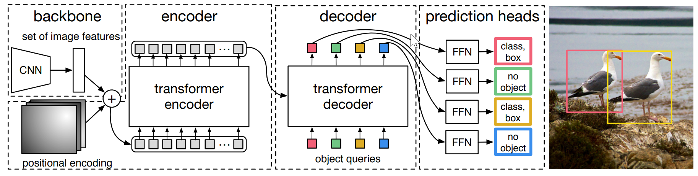

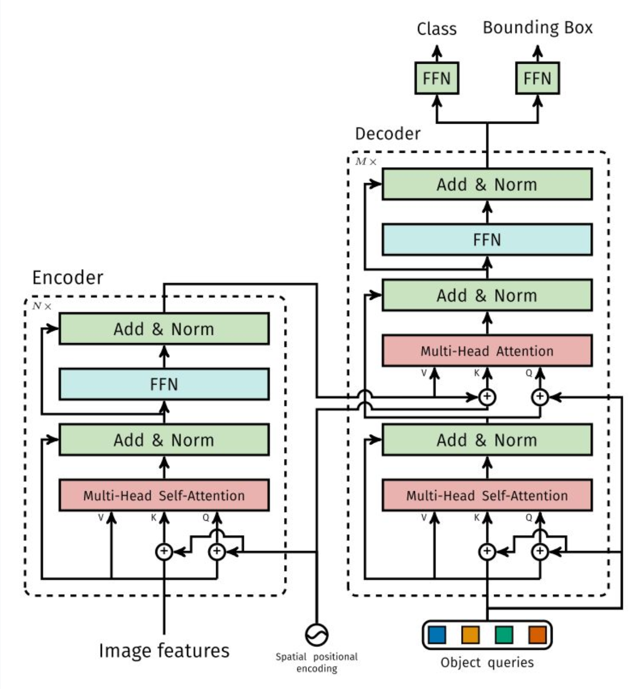

### 5.2 DETR 主模型实现

#### 5.2.1 初始化

**位置**：`code/detr/models/detr.py`

```python
class DETR(nn.Module):
    def __init__(self, backbone, transformer, num_classes, num_queries, aux_loss=False):
        super().__init__()
        self.num_queries = num_queries  # 查询数量（通常为 100）
        self.transformer = transformer  # Transformer 模块
        hidden_dim = transformer.d_model  # 隐藏维度（通常为 256）
        
        # 分类头：输出 num_classes + 1（+1 表示"无对象"类）
        self.class_embed = nn.Linear(hidden_dim, num_classes + 1)
        
        # 回归头：3层 MLP，输出 4 维边界框 (cx, cy, w, h)
        self.bbox_embed = MLP(hidden_dim, hidden_dim, 4, 3)
        
        # 可学习的对象查询嵌入
        # 维度: [num_queries, hidden_dim]
        # 注意：这里只使用 hidden_dim，而非 hidden_dim*2
        # 在 Transformer 中，query_embed 会被分离为位置编码和内容查询
        self.query_embed = nn.Embedding(num_queries, hidden_dim)
        
        # 输入投影层：将 backbone 输出投影到 hidden_dim
        self.input_proj = nn.Conv2d(backbone.num_channels, hidden_dim, kernel_size=1)
        
        self.backbone = backbone
        self.aux_loss = aux_loss  # 是否使用辅助损失
```

**关键设计**：
- **固定查询数**：`num_queries` 决定了模型能检测的最大对象数
- **"无对象"类别**：分类头输出 `num_classes + 1`，最后一个类别表示"无对象"
- **单尺度特征**：只使用最后一层特征（C5），1/32 分辨率

#### 5.2.2 前向传播

```python
def forward(self, samples: NestedTensor):
    # 1. 输入处理
    if isinstance(samples, (list, torch.Tensor)):
        samples = nested_tensor_from_tensor_list(samples)
    
    # 2. Backbone 特征提取
    features, pos = self.backbone(samples)
    # features: List[NestedTensor] - 多层特征（通常只用最后一层）
    # pos: List[Tensor] - 对应的位置编码
    
    # 3. 使用最后一层特征（C5）
    src, mask = features[-1].decompose()
    # src: [N, 2048, H/32, W/32]
    # mask: [N, H/32, W/32]
    
    # 4. 输入投影：将通道数从 2048 投影到 256
    src_proj = self.input_proj(src)  # [N, 256, H/32, W/32]
    
    # 5. Transformer 前向传播
    hs = self.transformer(
        src_proj,           # 投影后的特征
        mask,               # 填充掩码
        self.query_embed.weight,  # 对象查询嵌入
        pos[-1]             # 位置编码
    )[0]
    # hs: [num_layers, N, num_queries, hidden_dim]
    
    # 6. 预测头计算
    outputs_class = self.class_embed(hs)  # [num_layers, N, num_queries, num_classes+1]
    outputs_coord = self.bbox_embed(hs).sigmoid()  # [num_layers, N, num_queries, 4]
    
    # 7. 构建输出
    out = {
        'pred_logits': outputs_class[-1],  # 最后一层的分类 logits
        'pred_boxes': outputs_coord[-1]    # 最后一层的边界框坐标
    }
    
    # 8. 辅助损失（如果启用）
    if self.aux_loss:
        out['aux_outputs'] = self._set_aux_loss(outputs_class, outputs_coord)
    
    return out
```

**关键步骤**：
1. **特征提取**：Backbone 提取图像特征
2. **输入投影**：将特征投影到 Transformer 的隐藏维度
3. **Transformer 编码**：Encoder 对图像特征进行全局编码
4. **Transformer 解码**：Decoder 使用对象查询从编码特征中解码
5. **预测头**：分类和回归头生成最终预测

### 5.3 Transformer 实现

#### 5.3.1 Transformer 主类

**位置**：`code/detr/models/transformer.py`

```python
class Transformer(nn.Module):
    def __init__(self, d_model=512, nhead=8, num_encoder_layers=6,
                 num_decoder_layers=6, dim_feedforward=2048, dropout=0.1,
                 activation="relu", normalize_before=False,
                 return_intermediate_dec=False):
        super().__init__()
        
        # 构建 Encoder
        encoder_layer = TransformerEncoderLayer(
            d_model, nhead, dim_feedforward, dropout, activation, normalize_before
        )
        encoder_norm = nn.LayerNorm(d_model) if normalize_before else None
        self.encoder = TransformerEncoder(encoder_layer, num_encoder_layers, encoder_norm)
        
        # 构建 Decoder
        decoder_layer = TransformerDecoderLayer(
            d_model, nhead, dim_feedforward, dropout, activation, normalize_before
        )
        decoder_norm = nn.LayerNorm(d_model)
        self.decoder = TransformerDecoder(
            decoder_layer, num_decoder_layers, decoder_norm, return_intermediate_dec
        )
        
        self._reset_parameters()
        self.d_model = d_model
        self.nhead = nhead
```

**关键参数**：
- `d_model`：模型维度（通常为 256）
- `nhead`：注意力头数（通常为 8）
- `num_encoder_layers`：Encoder 层数（通常为 6）
- `num_decoder_layers`：Decoder 层数（通常为 6）
- `return_intermediate_dec`：是否返回中间层输出（用于辅助损失）

#### 5.3.2 Transformer 前向传播

```python
def forward(self, src, mask, query_embed, pos_embed):
    """
    Args:
        src: 输入特征 [N, C, H, W]
        mask: 填充掩码 [N, H, W]
        query_embed: 对象查询嵌入 [num_queries, hidden_dim]
        pos_embed: 位置编码 [N, hidden_dim, H, W]
    
    Returns:
        hs: 解码器输出 [num_layers, N, num_queries, hidden_dim]
        memory: 编码器输出 [N, C, H, W]
    """
    # 1. 展平空间维度
    bs, c, h, w = src.shape
    src = src.flatten(2).permute(2, 0, 1)  # [HW, N, C]
    pos_embed = pos_embed.flatten(2).permute(2, 0, 1)  # [HW, N, C]
    mask = mask.flatten(1)  # [N, HW]
    
    # 2. 准备对象查询
    query_embed = query_embed.unsqueeze(1).repeat(1, bs, 1)  # [num_queries, N, C]
    
    # 3. 初始化目标序列为全零
    # 注意：query_embed 包含位置信息，tgt 初始化为零
    # 在原始实现中，query_embed 是 hidden_dim*2，前一半是位置，后一半是内容
    # 但在这个实现中，query_embed 是 hidden_dim，位置信息通过 query_pos 传递
    tgt = torch.zeros_like(query_embed)  # [num_queries, N, C]
    
    # 4. Encoder 编码
    memory = self.encoder(src, src_key_padding_mask=mask, pos=pos_embed)
    # memory: [HW, N, C]
    
    # 5. Decoder 解码
    hs = self.decoder(
        tgt, memory,
        memory_key_padding_mask=mask,
        pos=pos_embed,
        query_pos=query_embed
    )
    # hs: [num_layers, num_queries, N, C]
    
    # 6. 调整维度顺序
    return hs.transpose(1, 2), memory.permute(1, 2, 0).view(bs, c, h, w)
    # hs: [num_layers, N, num_queries, C]
    # memory: [N, C, H, W]
```

**关键点**：
- **空间展平**：将 2D 特征图展平为序列
- **对象查询初始化**：`tgt` 初始化为零，位置信息通过 `query_pos` 传递
- **并行处理**：所有查询同时处理，而非自回归

#### 5.3.3 TransformerEncoderLayer

```python
class TransformerEncoderLayer(nn.Module):
    def __init__(self, d_model, nhead, dim_feedforward=2048, dropout=0.1,
                 activation="relu", normalize_before=False):
        super().__init__()
        
        # 自注意力层
        self.self_attn = nn.MultiheadAttention(d_model, nhead, dropout=dropout)
        
        # FFN
        self.linear1 = nn.Linear(d_model, dim_feedforward)
        self.dropout = nn.Dropout(dropout)
        self.linear2 = nn.Linear(dim_feedforward, d_model)
        
        # 归一化层
        self.norm1 = nn.LayerNorm(d_model)
        self.norm2 = nn.LayerNorm(d_model)
        
        # Dropout
        self.dropout1 = nn.Dropout(dropout)
        self.dropout2 = nn.Dropout(dropout)
        
        self.activation = _get_activation_fn(activation)
        self.normalize_before = normalize_before
    
    def forward_post(self, src, src_mask=None, src_key_padding_mask=None, pos=None):
        """
        后归一化模式（Post-Norm）
        """
        # 1. 自注意力
        q = k = self.with_pos_embed(src, pos)  # 添加位置编码
        src2 = self.self_attn(
            q, k, value=src,
            attn_mask=src_mask,
            key_padding_mask=src_key_padding_mask
        )[0]
        src = src + self.dropout1(src2)  # 残差连接
        src = self.norm1(src)  # 归一化
        
        # 2. FFN
        src2 = self.linear2(self.dropout(self.activation(self.linear1(src))))
        src = src + self.dropout2(src2)  # 残差连接
        src = self.norm2(src)  # 归一化
        
        return src
```

**关键点**：
- **自注意力**：每个特征像素关注所有其他像素
- **位置编码**：通过 `with_pos_embed` 添加到 query 和 key
- **残差连接**：每个子层都有残差连接

#### 5.3.4 TransformerDecoderLayer

```python
class TransformerDecoderLayer(nn.Module):
    def __init__(self, d_model, nhead, dim_feedforward=2048, dropout=0.1,
                 activation="relu", normalize_before=False):
        super().__init__()
        
        # 自注意力层（查询之间的交互）
        self.self_attn = nn.MultiheadAttention(d_model, nhead, dropout=dropout)
        
        # 交叉注意力层（查询关注图像特征）
        self.multihead_attn = nn.MultiheadAttention(d_model, nhead, dropout=dropout)
        
        # FFN
        self.linear1 = nn.Linear(d_model, dim_feedforward)
        self.dropout = nn.Dropout(dropout)
        self.linear2 = nn.Linear(dim_feedforward, d_model)
        
        # 归一化层
        self.norm1 = nn.LayerNorm(d_model)
        self.norm2 = nn.LayerNorm(d_model)
        self.norm3 = nn.LayerNorm(d_model)
        
        # Dropout
        self.dropout1 = nn.Dropout(dropout)
        self.dropout2 = nn.Dropout(dropout)
        self.dropout3 = nn.Dropout(dropout)
        
        self.activation = _get_activation_fn(activation)
        self.normalize_before = normalize_before
    
    def forward_post(self, tgt, memory, tgt_mask=None, memory_mask=None,
                     tgt_key_padding_mask=None, memory_key_padding_mask=None,
                     pos=None, query_pos=None):
        """
        后归一化模式
        """
        # 1. 自注意力（查询之间的交互）
        q = k = self.with_pos_embed(tgt, query_pos)
        tgt2 = self.self_attn(
            q, k, value=tgt,
            attn_mask=tgt_mask,
            key_padding_mask=tgt_key_padding_mask
        )[0]
        tgt = tgt + self.dropout1(tgt2)
        tgt = self.norm1(tgt)
        
        # 2. 交叉注意力（查询关注图像特征）
        tgt2 = self.multihead_attn(
            query=self.with_pos_embed(tgt, query_pos),  # 查询（添加位置编码）
            key=self.with_pos_embed(memory, pos),        # 键（图像特征 + 位置编码）
            value=memory,                                  # 值（图像特征）
            attn_mask=memory_mask,
            key_padding_mask=memory_key_padding_mask
        )[0]
        tgt = tgt + self.dropout2(tgt2)
        tgt = self.norm2(tgt)
        
        # 3. FFN
        tgt2 = self.linear2(self.dropout(self.activation(self.linear1(tgt))))
        tgt = tgt + self.dropout3(tgt2)
        tgt = self.norm3(tgt)
        
        return tgt
```

**关键点**：
- **自注意力**：对象查询之间的交互，建模对象关系
- **交叉注意力**：对象查询关注图像特征，提取对象信息
- **位置编码**：查询和图像特征都添加位置编码

### 5.4 二分图匹配实现

#### 5.4.1 匹配成本计算

**位置**：`code/detr/models/matcher.py`

```python
class HungarianMatcher(nn.Module):
    def __init__(self, cost_class: float = 1, cost_bbox: float = 1, cost_giou: float = 1):
        super().__init__()
        self.cost_class = cost_class  # 分类成本权重
        self.cost_bbox = cost_bbox    # 边界框 L1 成本权重
        self.cost_giou = cost_giou    # GIoU 成本权重
    
    @torch.no_grad()
    def forward(self, outputs, targets):
        """
        计算最优匹配
        
        Args:
            outputs: 模型输出，包含 'pred_logits' 和 'pred_boxes'
            targets: 目标列表，每个元素包含 'labels' 和 'boxes'
        
        Returns:
            indices: 匹配索引列表，每个元素为 (src_idx, tgt_idx) 元组
        """
        bs, num_queries = outputs["pred_logits"].shape[:2]
        
        # 计算每个样本的匹配成本
        out_prob = outputs["pred_logits"].flatten(0, 1).softmax(-1)  # [bs*num_queries, num_classes+1]
        out_bbox = outputs["pred_boxes"].flatten(0, 1)  # [bs*num_queries, 4]
        
        tgt_ids = torch.cat([v["labels"] for v in targets])  # 真实类别
        tgt_bbox = torch.cat([v["boxes"] for v in targets])  # 真实边界框
        
        # 计算分类成本：-log(p(c_i))
        cost_class = -out_prob[:, tgt_ids]  # [bs*num_queries, num_targets]
        
        # 计算边界框 L1 成本
        cost_bbox = torch.cdist(out_bbox, tgt_bbox, p=1)  # [bs*num_queries, num_targets]
        
        # 计算 GIoU 成本
        cost_giou = -generalized_box_iou(
            box_cxcywh_to_xyxy(out_bbox),
            box_cxcywh_to_xyxy(tgt_bbox)
        )  # [bs*num_queries, num_targets]
        
        # 加权组合成本
        C = self.cost_bbox * cost_bbox + self.cost_class * cost_class + self.cost_giou * cost_giou
        C = C.view(bs, num_queries, -1)  # [bs, num_queries, num_targets]
        
        # 为每个样本计算最优匹配
        sizes = [len(v["boxes"]) for v in targets]
        indices = [linear_sum_assignment(c[i].cpu().detach().numpy()) for i, c in enumerate(C.split(sizes, -1))]
        
        return [(torch.as_tensor(i, dtype=torch.int64), torch.as_tensor(j, dtype=torch.int64)) 
                for i, j in indices]
```

**关键点**：
- **匹配成本**：分类成本 + 边界框 L1 成本 + GIoU 成本
- **匈牙利算法**：使用 `linear_sum_assignment` 找到最优匹配
- **唯一分配**：每个真实对象只匹配一个预测

### 5.5 位置编码实现

根据论文，DETR 使用**固定的 2D 位置编码**：

```python
# 在 backbone 中生成位置编码
# 对 x 和 y 坐标分别使用 d/2 个不同频率的正弦和余弦函数
# 然后拼接得到 d 维位置编码

# 伪代码
def get_2d_position_encoding(h, w, d_model):
    """
    生成 2D 位置编码
    
    Args:
        h: 特征图高度
        w: 特征图宽度
        d_model: 模型维度
    
    Returns:
        pos: [h, w, d_model]
    """
    pos = torch.zeros(h, w, d_model)
    
    # x 坐标编码
    for i in range(d_model // 2):
        div_term = 10000 ** (2 * i / d_model)
        pos[:, :, 2*i] = torch.sin(torch.arange(w).float() / div_term)
        pos[:, :, 2*i+1] = torch.cos(torch.arange(w).float() / div_term)
    
    # y 坐标编码
    for i in range(d_model // 2):
        div_term = 10000 ** (2 * i / d_model)
        pos[:, :, d_model//2 + 2*i] = torch.sin(torch.arange(h).float() / div_term)
        pos[:, :, d_model//2 + 2*i+1] = torch.cos(torch.arange(h).float() / div_term)
    
    return pos
```

**设计要点**：
- **固定编码**：位置编码是固定的，不参与训练
- **2D 扩展**：将 1D 位置编码扩展到 2D
- **多频率**：使用不同频率捕获不同尺度的位置信息


## 6. 损失函数详解

### 6.1 SetCriterion 实现

**位置**：`code/detr/models/detr.py`

```python
class SetCriterion(nn.Module):
    def __init__(self, num_classes, matcher, weight_dict, eos_coef, losses):
        super().__init__()
        self.num_classes = num_classes
        self.matcher = matcher  # 匈牙利匹配器
        self.weight_dict = weight_dict  # 损失权重字典
        self.eos_coef = eos_coef  # "无对象"类别的权重
        self.losses = losses
        
        # 创建类别权重，"无对象"类别有特殊权重
        empty_weight = torch.ones(self.num_classes + 1)
        empty_weight[-1] = self.eos_coef
        self.register_buffer('empty_weight', empty_weight)
```

**关键设计**：
- **"无对象"类别权重**：`eos_coef` 用于平衡正负样本（通常为 0.1）
- **损失权重**：不同损失项可以有不同的权重

### 6.2 损失计算流程

```python
def forward(self, outputs, targets):
    # 1. 移除辅助输出
    outputs_without_aux = {k: v for k, v in outputs.items() if k != 'aux_outputs'}
    
    # 2. 二分图匹配
    indices = self.matcher(outputs_without_aux, targets)
    # indices: List[(src_idx, tgt_idx)]，每个元素对应一个样本
    
    # 3. 计算目标框数量（用于归一化）
    num_boxes = sum(len(t["labels"]) for t in targets)
    num_boxes = torch.as_tensor([num_boxes], dtype=torch.float, device=...)
    if is_dist_avail_and_initialized():
        torch.distributed.all_reduce(num_boxes)
    num_boxes = torch.clamp(num_boxes / get_world_size(), min=1).item()
    
    # 4. 计算所有损失
    losses = {}
    for loss in self.losses:
        losses.update(self.get_loss(loss, outputs, targets, indices, num_boxes))
    
    # 5. 辅助损失（如果启用）
    if 'aux_outputs' in outputs:
        for i, aux_outputs in enumerate(outputs['aux_outputs']):
            indices = self.matcher(aux_outputs, targets)
            for loss in self.losses:
                if loss == 'masks':
                    continue  # 中间层掩码损失计算成本太高
                kwargs = {}
                if loss == 'labels':
                    kwargs = {'log': False}  # 仅为最后一层记录日志
                l_dict = self.get_loss(loss, aux_outputs, targets, indices, num_boxes, **kwargs)
                l_dict = {k + f'_{i}': v for k, v in l_dict.items()}
                losses.update(l_dict)
    
    return losses
```

### 6.3 分类损失

```python
def loss_labels(self, outputs, targets, indices, num_boxes, log=True):
    assert 'pred_logits' in outputs
    src_logits = outputs['pred_logits']  # [N, num_queries, num_classes+1]
    
    # 获取匹配的预测和目标
    idx = self._get_src_permutation_idx(indices)
    target_classes_o = torch.cat([t["labels"][J] for t, (_, J) in zip(targets, indices)])
    
    # 创建目标类别张量（未匹配的为"无对象"类）
    target_classes = torch.full(
        src_logits.shape[:2], 
        self.num_classes,  # "无对象"类别索引
        dtype=torch.int64, 
        device=src_logits.device
    )
    target_classes[idx] = target_classes_o
    
    # 计算交叉熵损失（带类别权重）
    loss_ce = F.cross_entropy(
        src_logits.transpose(1, 2), 
        target_classes, 
        self.empty_weight
    )
    
    losses = {'loss_ce': loss_ce}
    
    if log:
        # 计算分类错误率（用于日志）
        losses['class_error'] = 100 - accuracy(src_logits[idx], target_classes_o)[0]
    
    return losses
```

**关键点**：
- **匹配的预测**：使用匹配索引获取对应的预测和目标
- **未匹配的预测**：被分配为"无对象"类别（索引为 `num_classes`）
- **类别权重**："无对象"类别有特殊权重（`eos_coef`），用于平衡正负样本

### 6.4 边界框损失

```python
def loss_boxes(self, outputs, targets, indices, num_boxes):
    assert 'pred_boxes' in outputs
    idx = self._get_src_permutation_idx(indices)
    src_boxes = outputs['pred_boxes'][idx]  # 匹配的预测框
    target_boxes = torch.cat([t['boxes'][i] for t, (_, i) in zip(targets, indices)], dim=0)
    
    # L1 损失
    loss_bbox = F.l1_loss(src_boxes, target_boxes, reduction='none')
    losses = {}
    losses['loss_bbox'] = loss_bbox.sum() / num_boxes
    
    # GIoU 损失
    loss_giou = 1 - torch.diag(box_ops.generalized_box_iou(
        box_ops.box_cxcywh_to_xyxy(src_boxes),
        box_ops.box_cxcywh_to_xyxy(target_boxes)
    ))
    losses['loss_giou'] = loss_giou.sum() / num_boxes
    
    return losses
```

**关键点**：
- **L1 损失**：直接回归边界框坐标
- **GIoU 损失**：考虑边界框的重叠和位置关系
- **组合使用**：两种损失结合使用，提升回归精度

---

## 7. 实验结果

### 7.1 性能对比

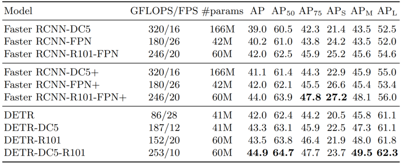

- **大目标检测**：DETR 在大目标上表现显著更好
- **小目标检测**：DETR 在小目标上表现较差
- **整体性能**：DETR 达到与 Faster R-CNN 相当的性能

### 7.2 实验

​	所有实验基于ResNet-50 的 DETR模型， 配置为6层编码器、6层解码器及256的宽度

#### 7.2.1 编码器层数的影响

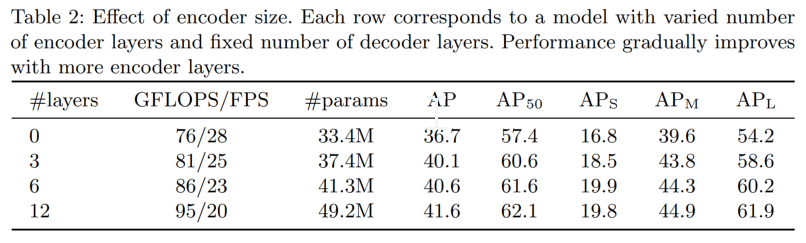

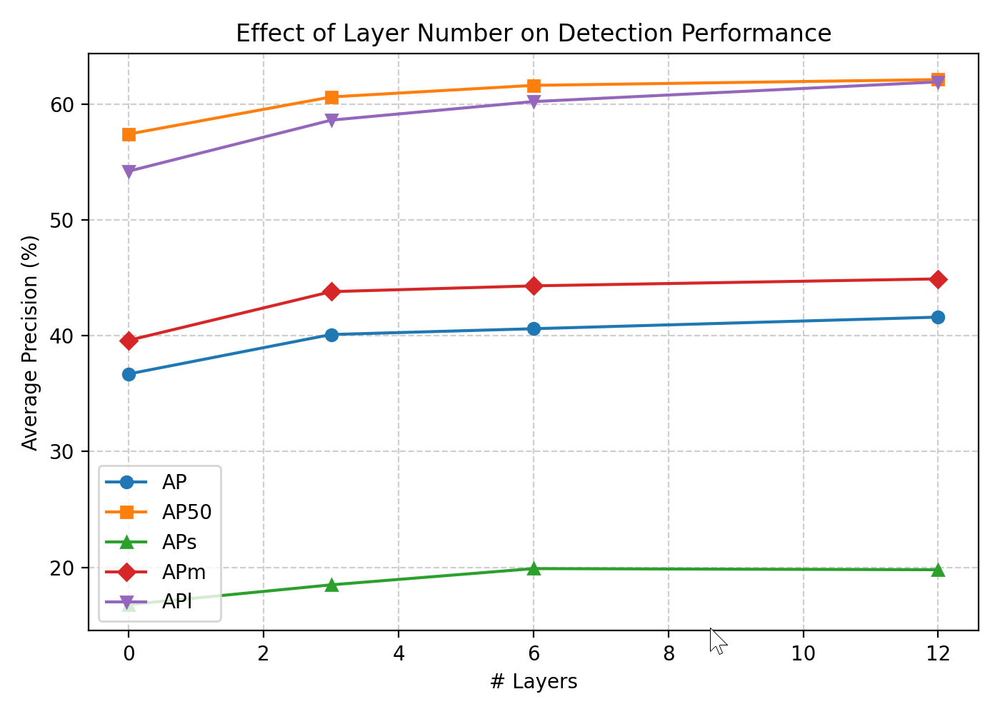		

​		通过改变编码器的层数来评估全局图像级自注意力机制的重要性。 AP随编码器层数的增加而递增。其中在大目标上有非常明显的提升。

#### 7.2.2 可视化最后一层编码器的注意力层

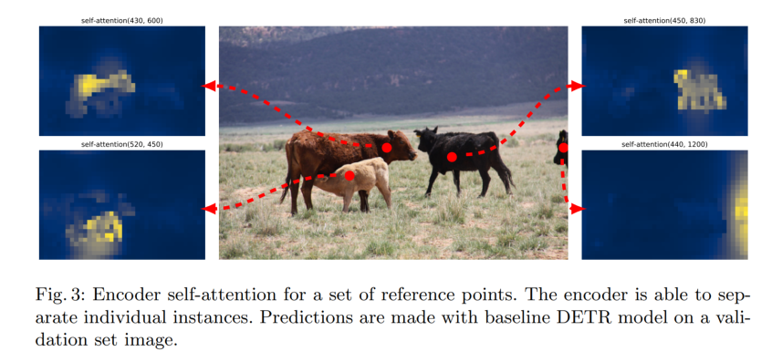

> 可以看出， 编码器似乎已经能够分离实例， 这可能简化了解码器对物体的提取和定位过程

#### 7.2.3 解码器层数分析

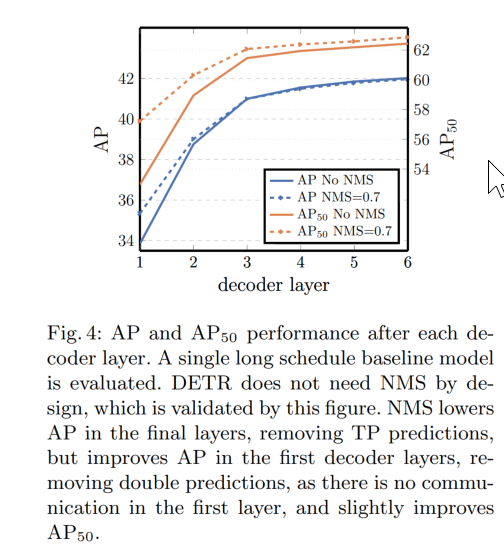


> 解码器采用共享分类头和回归头参数的辅助损失， 每层都会得到预测。 通过评估解码器各阶段预测出的对象， 来分析每个解码器的重要性。 NMS对首个解码器的预测结果有明显的提升， 随着层数的增加， 这种提升越来越小。 证明了decoderlayer 中的自注意力能够有效抑制重复预测。

#### 7.2.4 可视化解码器注意力

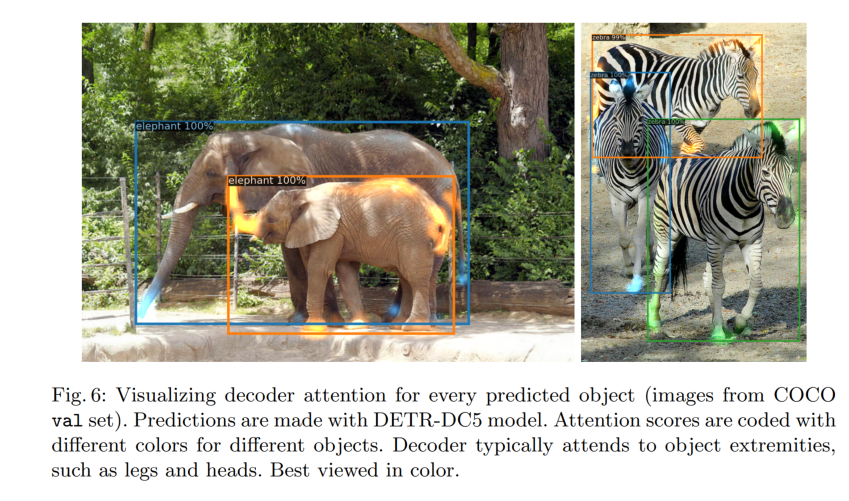

> 解码器注意力非常局部化， 主要关注物体的轮廓。 作者假设， 在编码器通过全局注意力分割实例后， 解码器只需要关注边缘轮廓即可提取类别和对象边界

#### 7.2.5 位置编码

​	DETR中包含了两种位置编码: 空间位置编码和输出位置编码。 作者尝试了固定编码和学习编码的各种组合方式， 实验结果见下表:

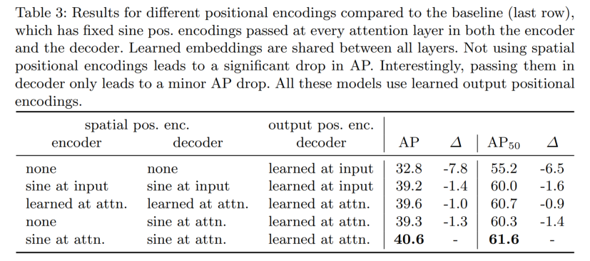

> 1. encode 和 decode 中不加入空间位置编码，仍能获得32.8的AP
> 2. **encode 中不加入空间位置编码， AP仅下降1.3** 

#### 7.2.6 损失函数

​	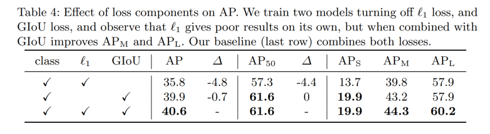

> 仅使用GIoU作为定位损失时， AP下降仅有0.7

#### 7.2.7 可视化预测槽的预测分布

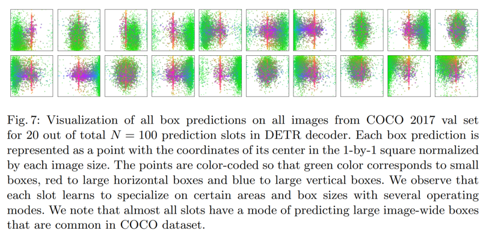

> 上图展示了20个槽位对COCO2017 验证集所有图像的边界预测可视化结果。 每个预测框以其中心坐标表示， 框的大小用颜色表示， 绿色代表小尺寸， 红色代表大尺寸横向框， 蓝色代表大尺寸纵向框。 可以看出， 各槽位会针对特定区域和框尺寸发展出多种预测模式。


## 8. 后续改进方向

DETR 的局限性催生了一系列改进工作：

1. **收敛速度**：
   - **Deformable DETR**：引入可变形注意力，加速收敛
   - **DAB-DETR**：显式 anchor boxes，提供更强的空间先验
   - **DN-DETR**：去噪训练，加速收敛

2. **小目标检测**：
   - **Deformable DETR**：多尺度特征融合
   - **DINO**：改进的去噪训练和特征选择

3. **性能提升**：
   - **DINO**：更好的训练策略，达到 SOTA 性能
   - **RT-DETR**：实时检测优化
