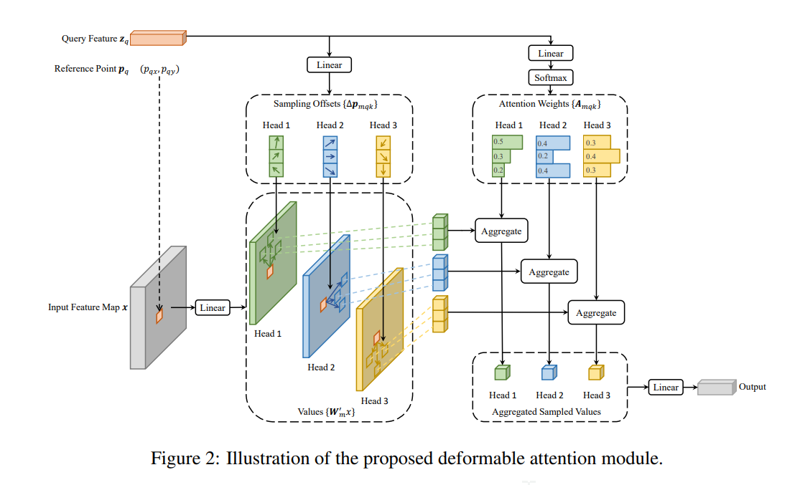
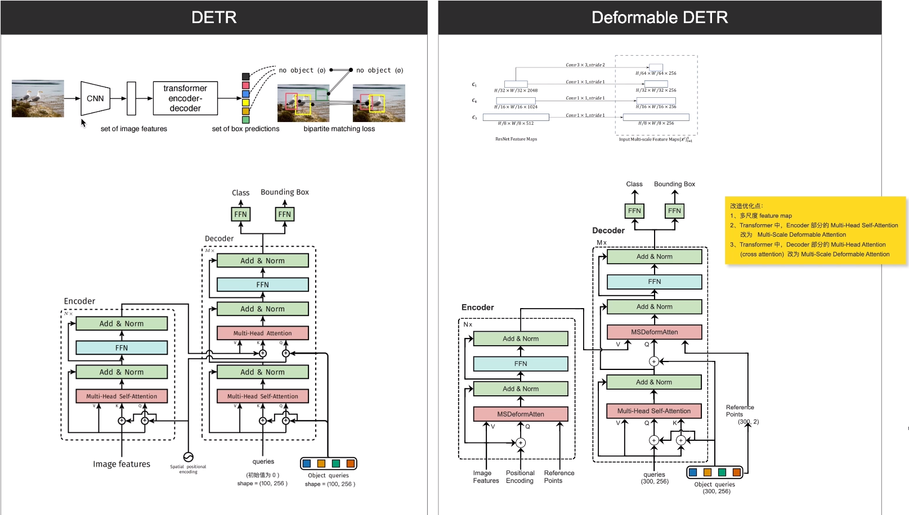
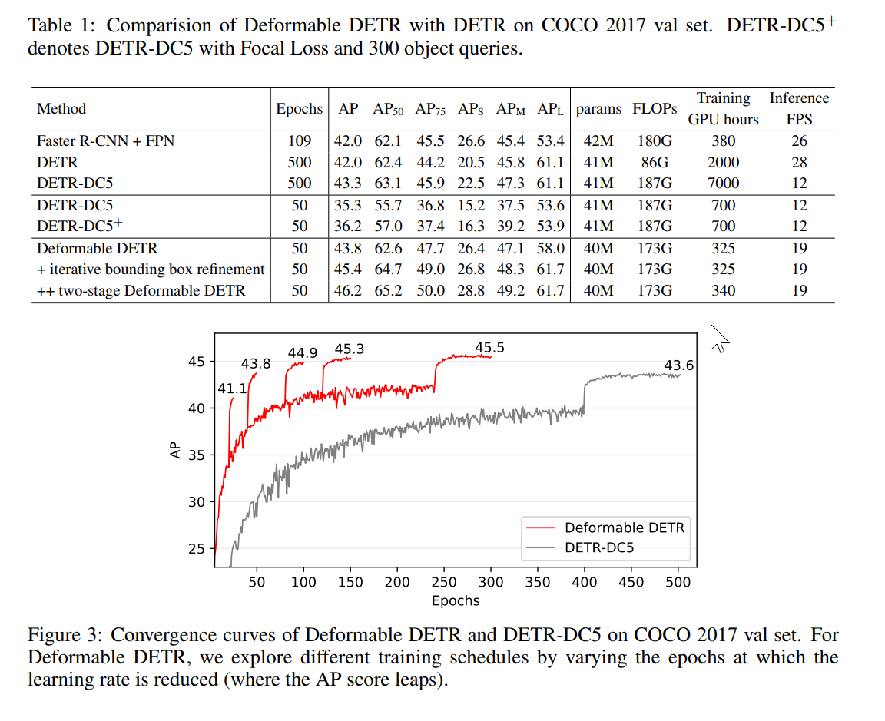
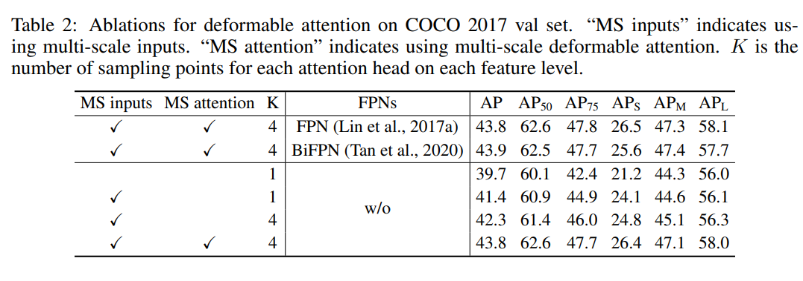
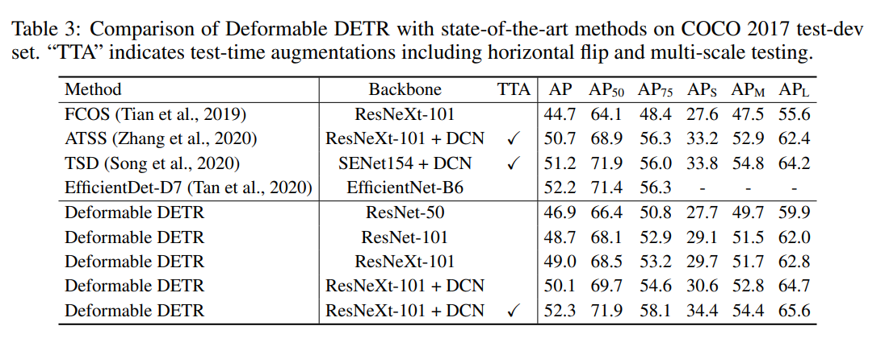
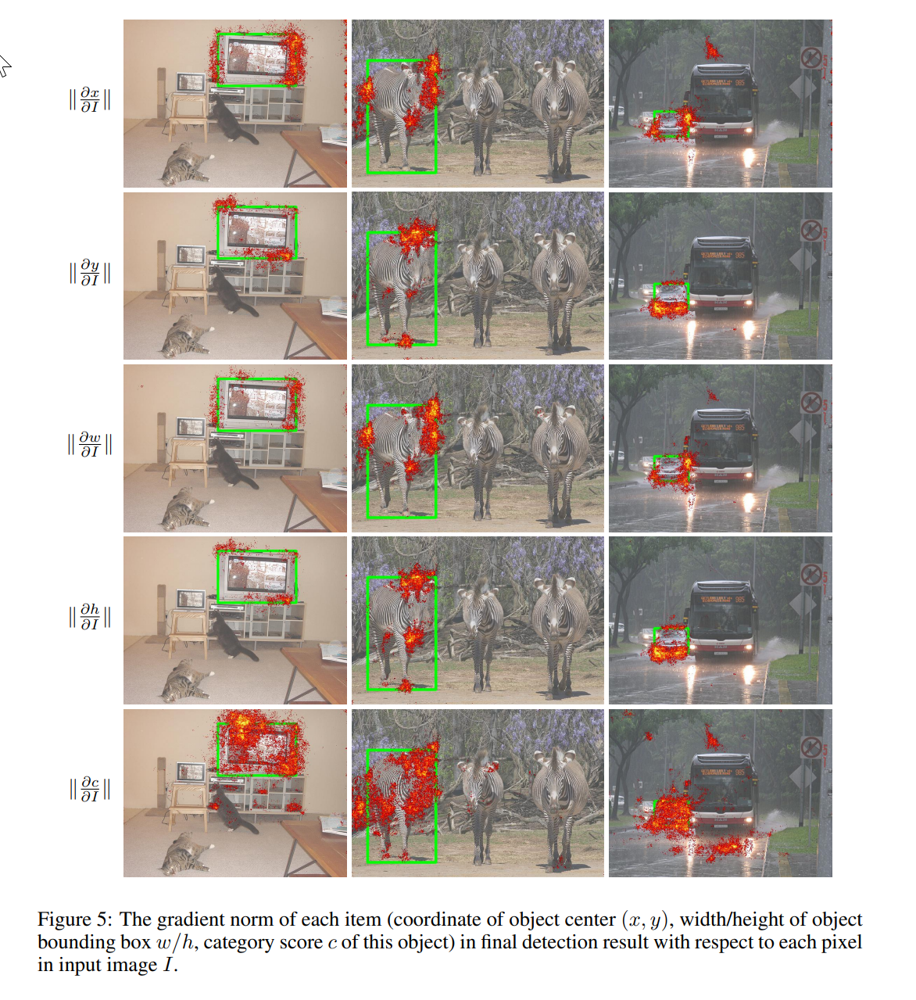
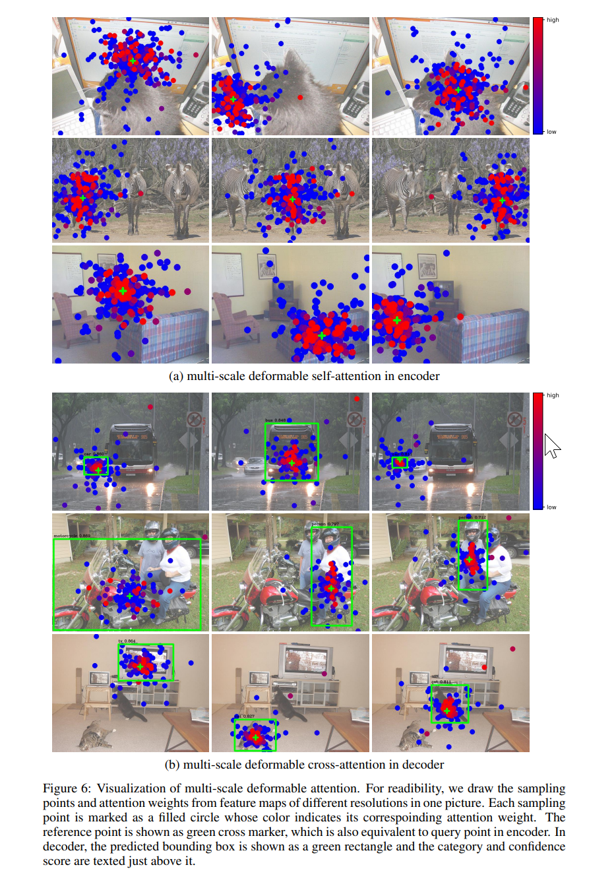

# Deformable DETR 论文详解与代码实现

## 目录
- [1. 论文概述](#1-论文概述)
- [2. 问题分析](#2-问题分析)
- [3. 解决方案](#3-解决方案)
- [4. 核心创新：多尺度可变形注意力](#4-核心创新多尺度可变形注意力)
- [5. 代码实现详解](#5-代码实现详解)
- [7. 实验结果与优势](#7-实验结果与优势)
- [8. 总结](#8-总结)

---

## 1. 论文概述

**论文标题**：Deformable DETR: Deformable Transformers for End-to-End Object Detection

**发表会议**：ICLR 2021

**核心贡献**：

- 提出**可变形注意力模块**（Deformable Attention Module），解决 DETR 收敛慢和小目标检测差的问题
- 引入**多尺度特征**，无需 FPN 即可聚合多尺度信息
- 实现**10倍训练加速**（从 500 epochs 降至 50 epochs）
- 在 COCO 数据集上取得更好的性能，特别是小目标检测

**论文链接**：[Deformable DETR](https://arxiv.org/abs/2010.04159)  
**代码仓库**：https://github.com/fundamentalvision/Deformable-DETR

---

## 2. 问题分析

### 2.1 DETR 的局限性

根据论文，DETR 存在以下主要问题：

#### 问题 1：收敛速度慢

**现象**：

- DETR 需要 **500 epochs** 才能收敛
- 比 Faster R-CNN 慢 **10-20 倍**

**根本原因**：

- Transformer 的注意力模块在初始化时对所有像素分配**几乎均匀的注意力权重**
- 需要大量训练才能学习到关注稀疏有意义位置的能力
- 注意力权重计算是**二次复杂度** O(N²)，其中 N 是像素数

#### 问题 2：小目标检测性能差

**现象**：

- DETR 在小目标检测上表现相对较差
- 现代检测器通常使用多尺度特征（高分辨率特征图用于小目标）

**根本原因**：

- DETR 只使用单尺度特征（C5，1/32 分辨率）
- 高分辨率特征图导致**计算和内存复杂度极高**
- Transformer encoder 的注意力计算复杂度为 O(HW × HW)，高分辨率时不可接受

#### 问题 3：计算复杂度高

**现象**：
- 处理高分辨率特征图时计算和内存消耗巨大

**根本原因**：
- Transformer 注意力机制需要计算所有像素对之间的注意力
- 复杂度为 O(N²)，其中 N = H × W（特征图像素数）

### 2.2 问题根源总结

论文指出，上述问题主要归因于 **Transformer 组件在处理图像特征图时的缺陷**：

1. **初始化时的均匀注意力**：需要长时间训练才能学习到稀疏关注
2. **二次复杂度**：限制了使用高分辨率特征图的可能性
3. **缺乏空间先验**：没有利用图像的空间局部性

---

## 3. 解决方案

### 3.1 核心思想

Deformable DETR 结合了：
- **可变形卷积的稀疏空间采样**：只关注参考点周围的关键采样点
- **Transformer 的关系建模能力**：保持 DETR 的端到端优势

### 3.2 主要改进

#### 改进 1：可变形注意力模块

**设计思路**：

- 不像 DETR 那样关注所有像素，而是只关注**参考点周围的一小部分采样点**
- 采样点位置是**可学习的**，由查询特征预测
- 每个查询只关注 K 个采样点（通常 K=4），而不是所有像素

**优势**：

- **计算复杂度从 O(N²) 降至 O(NK)**，其中 K << N
- **收敛更快**：采样点提供空间先验，加速学习
- **可处理高分辨率特征**：复杂度线性增长而非二次增长

#### 改进 2：多尺度特征聚合

**设计思路**：

- 使用多个特征层（C3, C4, C5, C6）
- 可变形注意力模块**自然支持多尺度**，无需 FPN
- 每个查询可以在不同尺度上采样

**优势**：
- **提升小目标检测**：高分辨率特征（C3）用于小目标
- **提升大目标检测**：低分辨率特征（C5, C6）用于大目标
- **无需额外 FPN**：可变形注意力直接处理多尺度

#### 改进 3：迭代边界框精炼

**设计思路**：

- 每层 decoder 基于上一层的预测框进行精炼
- 参考点随层迭代更新

**优势**：
- **渐进优化**：逐层精炼提升检测精度
- **训练稳定**：初始参考点提供良好起点

#### 改进 4：两阶段 Deformable DETR

**设计思路**：
- 第一阶段：Encoder 生成区域提议
- 第二阶段：Decoder 基于提议进行精炼

**优势**：

- **进一步提升性能**：两阶段设计提供更好的初始化

---

## 4. 核心创新：多尺度可变形注意力

### 4.1 可变形卷积回顾

**可变形卷积（Deformable Convolution）**的核心改进：

**相对于标准卷积**：标准卷积的采样位置固定（如3×3卷积核的9个位置），可变形卷积让采样位置可学习，网络根据输入内容自适应调整。

**实现方式**：网络预测每个采样点的偏移量 $\Delta p_k$，实际采样位置为 $p_k = p_0 + p_n^{(k)} + \Delta p_k$（基准位置 + 标准偏移 + 学习偏移），使用双线性插值从偏移后的位置采样特征值。

**数学表达**：
$$
\text{DeformConv}(x, p) = \text{Conv}\left(\sum_{k=1}^{K} \text{BilinearInterp}(x, p_0 + p_n^{(k)} + \Delta p_k)\right)
$$


### 4.2 可变形注意力

**可变形注意力（Deformable Attention）**是 Deformable DETR 的核心创新，它结合了**可学习的采样位置**和**查询相关的注意力权重**。



#### 4.2.1 核心思想

**基本流程**：

1. **查询特征**：每个查询 $z_q$ 带有位置信息（参考点 $p_q$）
2. **预测采样偏移**：由查询特征预测 K 个采样点的偏移量 $\Delta p_{qk}$
3. **预测注意力权重**：由查询特征预测 K 个采样点的权重 $A_{qk}$（经过 softmax 归一化）
4. **采样和聚合**：在偏移后的位置采样特征值，按权重加权求和

**单头单尺度公式**：
$$
\text{DeformAttn}(z_q, p_q, x) = \sum_{k=1}^{K} A_{qk} \cdot \text{BilinearInterp}(x, \phi(p_q) + \Delta p_{qk})
$$
其中：
- $A_{qk} = \text{softmax}(\text{Linear}(z_q))$：权重由查询特征预测
- $\Delta p_{qk} = \text{Linear}(z_q)$：偏移量由查询特征预测
- $\phi(p_q)$：将归一化参考点转换为特征图坐标

#### 4.2.2 多头设计

**多个注意力头**：
- 有 **M 个注意力头**（通常 M=8），每个头独立预测自己的采样偏移和权重
- 每个头关注不同的模式，增强表达能力
- 公式：$\text{DeformAttn}(z_q, p_q, x) = \sum_{m=1}^{M} W_m \left[ \sum_{k=1}^{K} A_{mqk} \cdot W'_m x(\phi(p_q) + \Delta p_{mqk}) \right]$

#### 4.2.3 多尺度设计

**多个特征层**：
- 可以在 **L 个不同尺度的特征层**上采样（通常 L=4：C3, C4, C5, C6）
- 对于每个尺度，都预测独立的采样偏移和权重
- 小目标可以在高分辨率特征（C3）上采样，大目标可以在低分辨率特征（C5, C6）上采样
- 公式：$\text{MSDeformAttn}(z_q, p_q, x) = \sum_{m=1}^{M} W_m \left[ \sum_{l=1}^{L} \sum_{k=1}^{K} A_{mlqk} \cdot W'_m x_l(\phi_l(p_q) + \Delta p_{mlqk}) \right]$

### 4.3 可变形注意力 vs 可变形卷积

两者都使用**可学习的采样偏移**，核心思想相同：

**相同点**：
- 都预测采样位置的偏移量 $\Delta p_k$
- 都使用双线性插值从偏移后的位置采样特征值
- 都支持自适应几何变换建模
- 采样位置计算方式相同：实际位置 = 基准位置 + 偏移量

**主要差异**：

| 特性 | 可变形卷积 | 可变形注意力 |
|------|-----------|-------------|
| **权重方式** | 固定或共享权重 | **查询相关的权重**（每个查询独立预测） |
| **输入** | 特征图 $x$ | **查询特征 $z_q$ + 特征图 $x$** |
| **参考点** | 卷积核中心 | **查询的参考点 $p_q$**（可学习） |
| **分组数** | 1 个（或少量分组） | **M 个注意力头**（通常 M=8） |
| **尺度数** | 1 个（单尺度） | **L 个特征层**（通常 L=4） |
| **应用场景** | Backbone 特征提取 | Transformer 编码器/解码器 |

### 4.4 计算流程

可变形注意力的计算过程：

1. **预测采样偏移**：每个查询、每个头、每个尺度，预测 K 个偏移量
   - 输出形状：`[N, 查询数, 头数, 尺度数, 采样点数, 2]`

2. **预测注意力权重**：每个查询、每个头，预测所有尺度×采样点的权重
   - 输出形状：`[N, 查询数, 头数, 尺度数, 采样点数]`
   - 经过 softmax 归一化，确保每个头的所有权重加起来等于 1

3. **计算采样位置**：参考点 + 预测偏移 = 实际采样位置
   - 对于每个尺度，需要将归一化的参考点坐标转换为该尺度的实际坐标

4. **多尺度采样**：在每个尺度的采样位置上，用双线性插值采样特征值

5. **加权聚合**：把从各个尺度、各个采样点得到的特征值，按权重加起来
   - 每个头独立计算，最后拼接起来

| 特性 | 可变形卷积 | 可变形注意力 |
|------|-----------|-------------|
| **分组数** | 1 个（或少量分组） | **M 个注意力头**（通常 M=8） |
| **尺度数** | 1 个（单尺度） | **L 个特征层**（通常 L=4：C3-C6） |
| **采样点数** | 通常 9 个（3×3） | 通常 4 个（更稀疏） |
| **权重** | 固定或共享的可学习权重 | **每个查询独立预测** |
| **偏移预测** | 从输入特征预测 | **从查询特征预测** |
| **计算复杂度** | O(NK) | O(NMK)（M 个头，但并行计算） |

### 4.5 为什么这样设计？

**为什么使用多个注意力头？**
- 不同的头可以关注不同的模式（比如一个头关注边缘，另一个头关注纹理）
- 类似于分组卷积，提高模型的表达能力

**为什么使用多尺度？**
- 小目标需要高分辨率特征（C3）才能检测到
- 大目标可以在低分辨率特征（C5, C6）上高效处理
- 无需额外的 FPN，可变形注意力自然支持多尺度

### 4.6 与 DETR 的对比

| 特性 | DETR | Deformable DETR |
|------|------|-----------------|
| **注意力范围** | 所有像素 | **K 个采样点**（K=4） |
| **计算复杂度** | O(N²) | **O(NK)**（线性增长） |
| **特征尺度** | 单尺度（C5） | **多尺度（C3-C6）** |
| **采样位置** | 固定（所有位置） | **可学习（预测偏移）** |
| **分组** | 多个注意力头 | **多个注意力头**（类似） |
| **收敛速度** | 500 epochs | **50 epochs**（10倍加速） |

---

## 5. 代码实现详解

本章按照**自顶向下**的方式讲解代码实现，从最基础的核心模块开始，逐步深入到整体架构。

**代码组织顺序**：
1. **多尺度可变形注意力模块**（MSDeformAttn）- 核心基础模块
2. **整体架构**（DeformableDETR）- 模型整体结构
3. **Encoder 实现** - 使用可变形注意力编码多尺度特征
4. **Decoder 实现** - 使用可变形注意力解码查询特征

---

### 5.1 多尺度可变形注意力模块（MSDeformAttn）

**位置**：`code/Deformable-DETR/models/ops/modules/ms_deform_attn.py`

这是 Deformable DETR 的**核心基础模块**，所有其他组件都基于它构建。理解这个模块是理解整个系统的关键。

#### 5.1.1 模块定义与初始化

```python
class MSDeformAttn(nn.Module):
    def __init__(self, d_model=256, n_levels=4, n_heads=8, n_points=4):
        """
        Multi-Scale Deformable Attention Module
        :param d_model      hidden dimension
        :param n_levels     number of feature levels
        :param n_heads      number of attention heads
        :param n_points     number of sampling points per attention head per feature level
        """
        super().__init__()
        if d_model % n_heads != 0:
            raise ValueError('d_model must be divisible by n_heads')
        
        self.d_model = d_model
        self.n_levels = n_levels
        self.n_heads = n_heads
        self.n_points = n_points
        
        # 采样偏移预测器：预测每个头、每个尺度、每个采样点的 (x, y) 偏移量
        self.sampling_offsets = nn.Linear(d_model, n_heads * n_levels * n_points * 2)
        # 注意力权重预测器：预测每个采样点的权重
        self.attention_weights = nn.Linear(d_model, n_heads * n_levels * n_points)
        # 特征投影层
        self.value_proj = nn.Linear(d_model, d_model)
        self.output_proj = nn.Linear(d_model, d_model)
        
        self._reset_parameters()

def _reset_parameters(self):
        # 采样偏移初始化：权重为0，偏置初始化为均匀分布的网格模式
    constant_(self.sampling_offsets.weight.data, 0.)
    thetas = torch.arange(self.n_heads, dtype=torch.float32) * (2.0 * math.pi / self.n_heads)
    grid_init = torch.stack([thetas.cos(), thetas.sin()], -1)
    grid_init = (grid_init / grid_init.abs().max(-1, keepdim=True)[0]).view(
        self.n_heads, 1, 1, 2).repeat(1, self.n_levels, self.n_points, 1)
    for i in range(self.n_points):
        grid_init[:, :, i, :] *= i + 1  # 不同采样点使用不同半径
    with torch.no_grad():
        self.sampling_offsets.bias = nn.Parameter(grid_init.view(-1))
    
    # 注意力权重初始化为0，softmax后接近均匀分布
    constant_(self.attention_weights.weight.data, 0.)
    constant_(self.attention_weights.bias.data, 0.)
    
    # 投影层使用Xavier初始化
    xavier_uniform_(self.value_proj.weight.data)
    constant_(self.value_proj.bias.data, 0.)
    xavier_uniform_(self.output_proj.weight.data)
    constant_(self.output_proj.bias.data, 0.)

def forward(self, query, reference_points, input_flatten, 
            input_spatial_shapes, input_level_start_index, 
            input_padding_mask=None):
    """
        :param query: (N, Length_{query}, C)
        :param reference_points: (N, Length_{query}, n_levels, 2) 或 (N, Length_{query}, n_levels, 4)
        :param input_flatten: (N, \sum_{l=0}^{L-1} H_l \cdot W_l, C)
        :param input_spatial_shapes: (n_levels, 2), [(H_0, W_0), (H_1, W_1), ...]
        :param input_level_start_index: (n_levels, ), [0, H_0*W_0, H_0*W_0+H_1*W_1, ...]
        :return output: (N, Length_{query}, C)
    """
    N, Len_q, _ = query.shape
    N, Len_in, _ = input_flatten.shape
    
    # Value 投影并重塑为多头格式
    value = self.value_proj(input_flatten)
    if input_padding_mask is not None:
        value = value.masked_fill(input_padding_mask[..., None], float(0))
    value = value.view(N, Len_in, self.n_heads, self.d_model // self.n_heads)
    
    # 预测采样偏移和注意力权重
    sampling_offsets = self.sampling_offsets(query).view(
        N, Len_q, self.n_heads, self.n_levels, self.n_points, 2)
    attention_weights = self.attention_weights(query).view(
        N, Len_q, self.n_heads, self.n_levels * self.n_points)
    attention_weights = F.softmax(attention_weights, -1)  # 归一化到每个头
    attention_weights = attention_weights.view(
        N, Len_q, self.n_heads, self.n_levels, self.n_points)
    
    # 计算采样位置：参考点 + 归一化偏移量
    if reference_points.shape[-1] == 2:
        # 2D参考点：根据特征图尺寸归一化偏移量
        offset_normalizer = torch.stack([input_spatial_shapes[..., 1], 
                                         input_spatial_shapes[..., 0]], -1)
        sampling_locations = reference_points[:, :, None, :, None, :] \
            + sampling_offsets / offset_normalizer[None, None, None, :, None, :]
    elif reference_points.shape[-1] == 4:
        # 4D参考点：偏移量根据框尺寸调制（大框允许更大偏移）
        # 每个查询位置的参考“锚框”，最后一维含义为(cx, cy, w, h)
        # 采样点 = 参考框中心 (cx, cy) + 偏移 (归一化到框宽高)
        # 其中偏移被缩放：n_points控制最大偏移量，*0.5确保采样点最多偏移整个框的一半
        sampling_locations = reference_points[:, :, None, :, None, :2] \
            + sampling_offsets / self.n_points * reference_points[:, :, None, :, None, 2:] * 0.5
    # 双线性插值采样 + 加权聚合（CUDA优化实现）
    output = MSDeformAttnFunction.apply(
        value, input_spatial_shapes, input_level_start_index, 
        sampling_locations, attention_weights, self.im2col_step)
    
    output = self.output_proj(output)
    return output
```

---

### 5.2 整体架构（DeformableDETR）

**位置**：`code/Deformable-DETR/models/deformable_detr.py`

在理解核心模块后，我们来看整体架构如何组织各个组件。



#### 5.2.1 模型初始化

```python
class DeformableDETR(nn.Module):
    """
    Deformable DETR 主模型类
    
    这是实现目标检测的 Deformable DETR 模块。相比原始 DETR，Deformable DETR 通过引入
    可变形注意力机制和多尺度特征，显著提升了收敛速度和检测性能。
    
    主要改进：
    1. 可变形注意力：只关注参考点周围的采样点，降低计算复杂度
    2. 多尺度特征：使用多个特征层（C3, C4, C5, C6）提升小目标检测
    3. 两阶段设计：可选的两阶段检测，进一步提升性能
    """
    def __init__(self, backbone, transformer, num_classes, num_queries, num_feature_levels,
                 aux_loss=True, with_box_refine=False, two_stage=False):
        """
        初始化 Deformable DETR 模型
        
        Args:
            backbone: 骨干网络模块，用于特征提取（如 ResNet-50）
            transformer: Transformer 架构模块，包含可变形注意力机制
            num_classes: 目标类别数量（不包括背景类，COCO 为 80）
            num_queries: 对象查询数量，即检测槽位数量（通常为 300）
            num_feature_levels: 使用的特征层数（通常为 4：C3, C4, C5, C6）
            aux_loss: 是否使用辅助解码损失（在每个 decoder 层计算损失）
            with_box_refine: 是否使用迭代边界框精炼
            two_stage: 是否使用两阶段 Deformable DETR
        """
        super().__init__()
        self.num_queries = num_queries  # 查询数量
        self.transformer = transformer  # Transformer 模块
        hidden_dim = transformer.d_model  # 隐藏维度（通常为 256）
        
        # 预测头
        self.class_embed = nn.Linear(hidden_dim, num_classes)
        self.bbox_embed = MLP(hidden_dim, hidden_dim, 4, 3)
        self.num_feature_levels = num_feature_levels
        
        # 查询嵌入（单阶段模式）
        if not two_stage:
            self.query_embed = nn.Embedding(num_queries, hidden_dim*2)
        
        # 多尺度特征投影层
        if num_feature_levels > 1:
            num_backbone_outs = len(backbone.strides)
            input_proj_list = []
            for _ in range(num_backbone_outs):
                in_channels = backbone.num_channels[_]
                input_proj_list.append(nn.Sequential(
                    nn.Conv2d(in_channels, hidden_dim, kernel_size=1),
                    nn.GroupNorm(32, hidden_dim),
                ))
            for _ in range(num_feature_levels - num_backbone_outs): # 生成 C6
                input_proj_list.append(nn.Sequential(
                    nn.Conv2d(in_channels, hidden_dim, kernel_size=3, stride=2, padding=1),
                    nn.GroupNorm(32, hidden_dim),
                ))
                in_channels = hidden_dim
            self.input_proj = nn.ModuleList(input_proj_list)
        else:
            self.input_proj = nn.ModuleList([
                nn.Sequential(
                    nn.Conv2d(backbone.num_channels[0], hidden_dim, kernel_size=1),
                    nn.GroupNorm(32, hidden_dim),
                )])
        
        self.backbone = backbone
        self.aux_loss = aux_loss
        self.with_box_refine = with_box_refine
        self.two_stage = two_stage

        # 权重初始化
        prior_prob = 0.01
        bias_value = -math.log((1 - prior_prob) / prior_prob)
        self.class_embed.bias.data = torch.ones(num_classes) * bias_value
        nn.init.constant_(self.bbox_embed.layers[-1].weight.data, 0)
        nn.init.constant_(self.bbox_embed.layers[-1].bias.data, 0)
        for proj in self.input_proj:
            nn.init.xavier_uniform_(proj[0].weight, gain=1)
            nn.init.constant_(proj[0].bias, 0)

        # 预测头数量配置
        # 解释：
        # 这段代码用于配置每一层解码器的预测头（分类和边框回归），支持标准和 box refinement（逐层边框优化）的两种模式，并兼容两阶段/单阶段结构。
        # 
        # - num_pred 决定需要多少组预测头（两阶段需要比解码器层数多一组，单阶段一样）
        # - with_box_refine：如果为 True，每一层都单独设置一组分类和 box 预测头，可独立学习；否则，所有层共用一个
        # - _get_clones 用于快速复制 N 份模块
        # - bbox_embed 最后一层 bias 初始化：前两项（中心坐标）为默认，宽高偏置特殊初始化，有助于稳定收敛
        # - 如果两阶段模式，还需要为解码器注入 class_embed，同时特殊初始化 bbox_embed 的 bias，第一层为 -2，其余层为 0（宽高先收缩，再慢慢学习）

        # 两阶段结构下，除了每层 decoder 的输出都需要一组预测头，还需要给 encoder 输出（即第一阶段）单独分配一组预测头
        num_pred = transformer.decoder.num_layers + 1 if two_stage else transformer.decoder.num_layers
        if with_box_refine:
            # 每一层解码器都独立一组 class 和 bbox 预测头
            self.class_embed = _get_clones(self.class_embed, num_pred)
            self.bbox_embed = _get_clones(self.bbox_embed, num_pred)
            # 为什么要将第一组 box 回归头最后一层的偏置初始化为 -2？
            # 这样做可以让网络刚开始训练时预测的宽高接近于较小的正值（因为 DETR 使用 sigmoid 回归宽高，-2≈sigmoid^-1(0.12)，即宽高初始占比约 0.12），
            # 有助于模型避免框一开始就过大导致训练不稳定，从而加速收敛。
            nn.init.constant_(self.bbox_embed[0].layers[-1].bias.data[2:], -2.0)
            # 将每一层 decoder 的 box 回归头独立赋给 transformer.decoder.bbox_embed，
            # 这样每层都可以独立学习边框回归能力，使 refinement（逐级精细化）更有效。
            self.transformer.decoder.bbox_embed = self.bbox_embed
        else:
            # 全部解码层共用同一组预测头
            nn.init.constant_(self.bbox_embed.layers[-1].bias.data[2:], -2.0)
            self.class_embed = nn.ModuleList([self.class_embed for _ in range(num_pred)])
            self.bbox_embed = nn.ModuleList([self.bbox_embed for _ in range(num_pred)])
            self.transformer.decoder.bbox_embed = None
        
        if two_stage:
            # 两阶段模式需设置 class_embed，并且把每一组 box_embed 的 bias 初始化为 0（宽高先不收缩）
            self.transformer.decoder.class_embed = self.class_embed
            for box_embed in self.bbox_embed:
                nn.init.constant_(box_embed.layers[-1].bias.data[2:], 0.0)
```

#### 5.2.2 前向传播流程

```python
    def forward(self, samples: NestedTensor):
        """
        前向传播函数
        
        Args:
            samples: NestedTensor，包含图像和掩码
                - samples.tensor: [batch_size, 3, H, W] - 批处理图像
                - samples.mask: [batch_size, H, W] - 填充掩码（填充处为 1）
        
        Returns:
            dict: 包含预测结果的字典
                - "pred_logits": [batch_size, num_queries, num_classes] - 分类 logits
                - "pred_boxes": [batch_size, num_queries, 4] - 边界框坐标 (cx, cy, w, h)
                - "aux_outputs": 可选，辅助损失输出
                - "enc_outputs": 可选，两阶段模式的 encoder 输出
        """
        # 特征提取
        if not isinstance(samples, NestedTensor):
            samples = nested_tensor_from_tensor_list(samples)
        features, pos = self.backbone(samples)

        # 多尺度特征投影
        srcs = []
        masks = []
        for l, feat in enumerate(features):
            src, mask = feat.decompose()
            srcs.append(self.input_proj[l](src))
            masks.append(mask)
        
        # 生成额外特征层（如 C6）
        if self.num_feature_levels > len(srcs):
            _len_srcs = len(srcs)
            for l in range(_len_srcs, self.num_feature_levels):
                if l == _len_srcs:
                    src = self.input_proj[l](features[-1].tensors)
                else:
                    src = self.input_proj[l](srcs[-1])
                m = samples.mask
                mask = F.interpolate(m[None].float(), size=src.shape[-2:]).to(torch.bool)[0]
                pos_l = self.backbone[1](NestedTensor(src, mask)).to(src.dtype)
                srcs.append(src)
                masks.append(mask)
                pos.append(pos_l)

        # Transformer 编码和解码流程
        # query_embed：查询嵌入向量，仅在一阶段模式下使用（即不使用两阶段时）
        query_embed = None  # 默认置空
        if not self.two_stage:
            # 一阶段时，为每个查询采样点分配可学习的嵌入向量，作为解码器输入
            query_embed = self.query_embed.weight  # [num_queries, d_model]
        # 调用 Transformer，完成特征编码和解码
        # 返回值说明：
        # hs: 每层解码器的隐层输出，[num_decoder_layers, batch_size, num_queries, hidden_dim]
        # init_reference: 每个查询的初始参考点（参考框），通常在 [0,1] 范围内
        # inter_references: 解码器每层后，更新后的参考点（边界框迭代精化用）
        # enc_outputs_class: Encoder 输出的分类预测（两阶段模式下用作 object proposal）
        # enc_outputs_coord: Encoder 输出的边界框回归结果
        hs, init_reference, inter_references, enc_outputs_class, enc_outputs_coord = \
            self.transformer(srcs, masks, pos, query_embed)

        # 预测头计算
        outputs_classes = []
        outputs_coords = []
        # 遍历每一层 Decoder 的输出
        for lvl in range(hs.shape[0]):
            # 获取每一层对应的参考框（init_reference 是初始参考点，inter_references 是后续每层的参考点）
            reference = init_reference if lvl == 0 else inter_references[lvl - 1]
            # 将参考点从 sigmoid 空间还原到原始空间
            reference = inverse_sigmoid(reference)
            
            # 分类分支，得到每一层的类别预测
            outputs_class = self.class_embed[lvl](hs[lvl])
            # 回归分支，预测 bbox 的偏移量
            tmp = self.bbox_embed[lvl](hs[lvl])
            
            # 兼容两种形式：有的参考点维度是 4（cx, cy, w, h），有的是 2（cx, cy）
            if reference.shape[-1] == 4:
                # 若为4维，直接相加
                tmp += reference
            else:
                # 若为2维，只加前两维
                tmp[..., :2] += reference
            
            # 对最终预测框做归一化（映射到0-1之间）
            outputs_coord = tmp.sigmoid()
            # 保存每一层的分类结果和坐标结果
            outputs_classes.append(outputs_class)
            outputs_coords.append(outputs_coord)
        
        # 堆叠所有层的输出，shape: [num_layers, batch_size, num_queries, ...]
        outputs_class = torch.stack(outputs_classes)
        outputs_coord = torch.stack(outputs_coords)

        # 构建输出
        out = {
            'pred_logits': outputs_class[-1],
            'pred_boxes': outputs_coord[-1]
        }
        if self.aux_loss:
            out['aux_outputs'] = self._set_aux_loss(outputs_class, outputs_coord)
        if self.two_stage:
            out['enc_outputs'] = {
                'pred_logits': enc_outputs_class,
                'pred_boxes': enc_outputs_coord
            }
        return out
```

**关键设计点**：
- **多尺度特征处理**：通过 `input_proj` 将不同通道数的特征投影到统一维度
- **查询嵌入**：单阶段模式使用可学习的查询嵌入，两阶段模式由 encoder 生成
- **迭代精炼**：如果启用 `with_box_refine`，每层基于上一层的预测框进行精炼
- **辅助损失**：每层都计算损失，加速训练

---

### 5.3 Backbone 实现

**位置**：`code/Deformable-DETR/models/backbone.py`

Backbone 负责从输入图像中提取多尺度特征，是 Deformable DETR 的第一阶段。通常使用 ResNet-50 或 ResNet-101 作为骨干网络。

#### 5.3.1 Backbone 架构概览

**主要组件**：
1. **ResNet 骨干网络**：提取多尺度特征（C3, C4, C5）
2. **FrozenBatchNorm2d**：冻结的 BatchNorm，用于稳定训练
3. **IntermediateLayerGetter**：提取中间层特征
4. **位置编码生成器**：为每个特征层生成位置编码

**特征层说明**：
- **C3**：来自 ResNet 的 `layer2`，stride=8，通道数=512
- **C4**：来自 ResNet 的 `layer3`，stride=16，通道数=1024
- **C5**：来自 ResNet 的 `layer4`，stride=32，通道数=2048

#### 5.3.2 Backbone 类实现

```python
class Backbone(BackboneBase):
    """ResNet backbone with frozen BatchNorm."""
    def __init__(self, name: str,
                 train_backbone: bool,
                 return_interm_layers: bool,
                 dilation: bool):
        """
        初始化 Backbone
        
        Args:
            name: ResNet 模型名称（如 'resnet50', 'resnet101'）
            train_backbone: 是否训练 backbone（如果 False，只训练 layer2, layer3, layer4）
            return_interm_layers: 是否返回中间层特征（多尺度模式需要）
            dilation: 是否在 layer4 使用空洞卷积（保持分辨率）
        """
        # 使用 FrozenBatchNorm2d 替代标准 BatchNorm
        # 原因：backbone 通常使用预训练权重，BatchNorm 的统计量应该冻结
        norm_layer = FrozenBatchNorm2d
        
        # 从 torchvision 加载预训练的 ResNet 模型
        backbone = getattr(torchvision.models, name)(
            replace_stride_with_dilation=[False, False, dilation],
            pretrained=is_main_process(),  # 只在主进程加载预训练权重
            norm_layer=norm_layer
        )
        
        # 只支持 ResNet-50 及以上（通道数硬编码）
        assert name not in ('resnet18', 'resnet34'), "number of channels are hard coded"
        
        # 调用父类初始化
        super().__init__(backbone, train_backbone, return_interm_layers)
        
        # 如果使用空洞卷积，stride 减半（保持更高分辨率）
        if dilation:
            self.strides[-1] = self.strides[-1] // 2
```

#### 5.3.3 BackboneBase 基类

```python
class BackboneBase(nn.Module):
    def __init__(self, backbone: nn.Module, train_backbone: bool, return_interm_layers: bool):
        """
        初始化 Backbone 基类
        
        Args:
            backbone: ResNet 模型实例
            train_backbone: 是否训练 backbone
            return_interm_layers: 是否返回中间层特征
        """
        super().__init__()
        
        # ========== 1. 冻结部分层参数 ==========
        # 如果 train_backbone=False，冻结所有参数
        # 如果 train_backbone=True，只训练 layer2, layer3, layer4
        # layer1 通常冻结（使用预训练特征）
        for name, parameter in backbone.named_parameters():
            if not train_backbone or 'layer2' not in name and 'layer3' not in name and 'layer4' not in name:
                parameter.requires_grad_(False)
        
        # ========== 2. 配置返回的特征层 ==========
        if return_interm_layers:
            # 多尺度模式：返回 layer2, layer3, layer4（对应 C3, C4, C5）
            return_layers = {"layer2": "0", "layer3": "1", "layer4": "2"}
            self.strides = [8, 16, 32]      # 各层的下采样步长
            self.num_channels = [512, 1024, 2048]  # 各层的通道数
        else:
            # 单尺度模式：只返回 layer4（对应 C5）
            return_layers = {'layer4': "0"}
            self.strides = [32]
            self.num_channels = [2048]
        
        # ========== 3. 使用 IntermediateLayerGetter 提取中间层 ==========
        # IntermediateLayerGetter 是 torchvision 的工具类
        # 可以从 ResNet 中提取指定层的输出
        self.body = IntermediateLayerGetter(backbone, return_layers=return_layers)
    
    def forward(self, tensor_list: NestedTensor):
        """
        前向传播
        
        Args:
            tensor_list: NestedTensor，包含图像和掩码
                - tensor_list.tensors: [N, 3, H, W] - 图像
                - tensor_list.mask: [N, H, W] - 填充掩码
        
        Returns:
            Dict[str, NestedTensor]: 各层特征，键为层名（"0", "1", "2"）
        """
        # 提取中间层特征
        xs = self.body(tensor_list.tensors)
        # xs: Dict[str, Tensor] = {"0": C3, "1": C4, "2": C5}
        
        out: Dict[str, NestedTensor] = {}
        for name, x in xs.items():
            # 为每个特征层调整掩码尺寸
            m = tensor_list.mask
            assert m is not None
            # 将掩码下采样到特征图尺寸
            mask = F.interpolate(m[None].float(), size=x.shape[-2:]).to(torch.bool)[0]
            # 封装为 NestedTensor
            out[name] = NestedTensor(x, mask)
        
        return out
```

#### 5.3.4 FrozenBatchNorm2d

```python
class FrozenBatchNorm2d(torch.nn.Module):
    """
    冻结的 BatchNorm2d
    
    在预训练模型中，BatchNorm 的统计量（running_mean, running_var）和
    可学习参数（weight, bias）应该冻结，保持与预训练时一致。
    """
    def __init__(self, n, eps=1e-5):
        super(FrozenBatchNorm2d, self).__init__()
        # 使用 register_buffer 注册为缓冲区（不参与梯度计算）
        self.register_buffer("weight", torch.ones(n))
        self.register_buffer("bias", torch.zeros(n))
        self.register_buffer("running_mean", torch.zeros(n))
        self.register_buffer("running_var", torch.ones(n))
        self.eps = eps
    
    def forward(self, x):
        """
        前向传播：应用冻结的 BatchNorm
        
        公式：y = (x - running_mean) / sqrt(running_var + eps) * weight + bias
        """
        w = self.weight.reshape(1, -1, 1, 1)
        b = self.bias.reshape(1, -1, 1, 1)
        rv = self.running_var.reshape(1, -1, 1, 1)
        rm = self.running_mean.reshape(1, -1, 1, 1)
        eps = self.eps
        
        # 计算缩放和偏移
        scale = w * (rv + eps).rsqrt()
        bias = b - rm * scale
        
        # 应用归一化
        return x * scale + bias
```

**为什么使用 FrozenBatchNorm？**
- **预训练权重兼容性**：预训练的 ResNet 使用 BatchNorm，需要保持统计量一致
- **训练稳定性**：冻结 BatchNorm 避免统计量在训练过程中变化
- **推理一致性**：训练和推理时使用相同的统计量

#### 5.3.5 Joiner：Backbone + 位置编码

```python
class Joiner(nn.Sequential):
    """
    组合 Backbone 和位置编码生成器
    
    这是一个 Sequential 模块，包含：
    - [0]: Backbone - 提取特征
    - [1]: PositionEmbedding - 生成位置编码
    """
    def __init__(self, backbone, position_embedding):
        super().__init__(backbone, position_embedding)
        # 保存 backbone 的属性，供外部访问
        self.strides = backbone.strides
        self.num_channels = backbone.num_channels
    
    def forward(self, tensor_list: NestedTensor):
        """
        前向传播：提取特征并生成位置编码
        
        Args:
            tensor_list: NestedTensor，包含图像和掩码
        
        Returns:
            out: List[NestedTensor] - 各层特征（C3, C4, C5）
            pos: List[Tensor] - 各层的位置编码
        """
        # 1. 通过 Backbone 提取特征
        xs = self[0](tensor_list)  # Dict[str, NestedTensor]
        
        out: List[NestedTensor] = []
        pos = []
        
        # 2. 按层名排序（确保顺序：C3, C4, C5）
        for name, x in sorted(xs.items()):
            out.append(x)
        
        # 3. 为每个特征层生成位置编码
        for x in out:
            pos.append(self[1](x).to(x.tensors.dtype))
            # self[1] 是位置编码生成器
            # 输入：NestedTensor，输出：位置编码 [N, C, H, W]
        
        return out, pos
```

#### 5.3.6 ResNet 特征提取流程

**ResNet-50 结构**（以输入图像 800×800 为例）：

```
输入图像: [N, 3, 800, 800]
  ↓
Conv1 + BN + ReLU + MaxPool
  ↓
Layer1 (ResBlock × 3)
  → 输出: [N, 256, 200, 200] (stride=4) - 不使用
  ↓
Layer2 (ResBlock × 4)
  → 输出: [N, 512, 100, 100] (stride=8) - **C3**
  ↓
Layer3 (ResBlock × 6)
  → 输出: [N, 1024, 50, 50] (stride=16) - **C4**
  ↓
Layer4 (ResBlock × 3)
  → 输出: [N, 2048, 25, 25] (stride=32) - **C5**
```

**特征层详细信息**：

| 特征层 | ResNet 层 | 通道数 | Stride | 空间尺寸 (800×800输入) | 用途 |
|--------|-----------|--------|--------|----------------------|------|
| **C3** | layer2 | 512 | 8 | 100×100 | 小目标检测（高分辨率） |
| **C4** | layer3 | 1024 | 16 | 50×50 | 中等目标检测 |
| **C5** | layer4 | 2048 | 32 | 25×25 | 大目标检测（低分辨率） |

#### 5.3.7 位置编码生成

位置编码为每个特征层生成，用于告诉 Transformer 每个特征像素的空间位置。

```python
# 在 Joiner.forward() 中
for x in out:
    pos.append(self[1](x).to(x.tensors.dtype))
    # self[1] 是位置编码生成器（PositionEmbeddingSine）
    # 输入：NestedTensor [N, C, H, W]
    # 输出：位置编码 [N, C, H, W]
```

**位置编码类型**：
- **正弦位置编码**（PositionEmbeddingSine）：使用 sin/cos 函数生成
- **学习位置编码**（PositionEmbeddingLearned）：可学习的嵌入

#### 5.3.8 关键设计点

1. **多尺度特征提取**：
   - 提取 C3, C4, C5 三层特征，覆盖不同尺度
   - C3 用于小目标，C5 用于大目标

2. **参数冻结策略**：
   - 默认只训练 layer2, layer3, layer4
   - layer1 和 conv1 通常冻结（使用预训练特征）

3. **FrozenBatchNorm**：
   - 保持预训练模型的 BatchNorm 统计量
   - 避免训练时统计量变化导致性能下降

4. **掩码处理**：
   - 为每个特征层调整掩码尺寸
   - 确保掩码与特征图尺寸匹配

5. **位置编码**：
   - 为每个特征层独立生成位置编码
   - 告诉 Transformer 每个像素的空间位置

---

### 5.4 DeformableTransformer 实现

**位置**：`code/Deformable-DETR/models/deformable_transformer.py`

`DeformableTransformer` 是连接 Encoder 和 Decoder 的顶层模块，负责协调整个 Transformer 的前向传播，处理多尺度特征的展平、拼接，以及单阶段和两阶段模式的切换。

#### 5.4.1 DeformableTransformer 类定义

```python
class DeformableTransformer(nn.Module):
    """
    Deformable Transformer 主模块
    
    这是整个 Transformer 的顶层模块，包含：
    1. Encoder：多尺度可变形自注意力编码器
    2. Decoder：多尺度可变形交叉注意力解码器
    3. 参考点生成：单阶段或两阶段模式
    """
    def __init__(self, d_model=256, nhead=8,
                 num_encoder_layers=6, num_decoder_layers=6, 
                 dim_feedforward=1024, dropout=0.1,
                 activation="relu", return_intermediate_dec=False,
                 num_feature_levels=4, dec_n_points=4, enc_n_points=4,
                 two_stage=False, two_stage_num_proposals=300):
        """
        初始化 Deformable Transformer
        
        Args:
            d_model: 隐藏维度（通常为 256）
            nhead: 注意力头数（通常为 8）
            num_encoder_layers: Encoder 层数（通常为 6）
            num_decoder_layers: Decoder 层数（通常为 6）
            dim_feedforward: FFN 维度（通常为 1024）
            dropout: Dropout 比率
            activation: 激活函数（通常为 "relu"）
            return_intermediate_dec: 是否返回中间层输出（用于辅助损失）
            num_feature_levels: 特征层数（通常为 4：C3, C4, C5, C6）
            dec_n_points: Decoder 的采样点数（通常为 4）
            enc_n_points: Encoder 的采样点数（通常为 4）
            two_stage: 是否使用两阶段模式
            two_stage_num_proposals: 两阶段模式的提议数（通常为 300）
        """
        super().__init__()
        
        self.d_model = d_model
        self.nhead = nhead
        self.two_stage = two_stage
        self.two_stage_num_proposals = two_stage_num_proposals
        
        # 创建 Encoder 和 Decoder
        encoder_layer = DeformableTransformerEncoderLayer(
            d_model, dim_feedforward, dropout, activation,
            num_feature_levels, nhead, enc_n_points
        )
        self.encoder = DeformableTransformerEncoder(encoder_layer, num_encoder_layers)
        
        decoder_layer = DeformableTransformerDecoderLayer(
            d_model, dim_feedforward, dropout, activation,
            num_feature_levels, nhead, dec_n_points
        )
        self.decoder = DeformableTransformerDecoder(
            decoder_layer, num_decoder_layers, return_intermediate_dec
        )
        
        # 层级嵌入：区分不同尺度的特征
        self.level_embed = nn.Parameter(torch.Tensor(num_feature_levels, d_model))
        
        # 参考点生成（单阶段模式）
        if not two_stage:
            self.reference_points = nn.Linear(d_model, 2)
        
        # 两阶段模式相关组件
        if two_stage:
            self.enc_output = nn.Linear(d_model, d_model)
            self.enc_output_norm = nn.LayerNorm(d_model)
            self.pos_trans = nn.Linear(d_model * 2, d_model * 2)
            self.pos_trans_norm = nn.LayerNorm(d_model * 2)
        
        # 初始化参数
        self._reset_parameters()
    
    def _reset_parameters(self):
        """初始化参数"""
        # 所有参数使用 Xavier 初始化
        for p in self.parameters():
            if p.dim() > 1:
                nn.init.xavier_uniform_(p)
        
        # MSDeformAttn 模块的特殊初始化
        for m in self.modules():
            if isinstance(m, MSDeformAttn):
                m._reset_parameters()
        
        # 参考点生成层初始化（单阶段模式）
        if not self.two_stage:
            xavier_uniform_(self.reference_points.weight.data, gain=1.0)
            constant_(self.reference_points.bias.data, 0.)
        
        # 层级嵌入初始化为正态分布
        normal_(self.level_embed)
```

#### 5.4.2 前向传播流程

```python
    def forward(self, srcs, masks, pos_embeds, query_embed=None):
        """
        Transformer 前向传播
        
        Args:
            srcs: List[Tensor] - 多尺度特征列表 [C3, C4, C5, ...]
                每个元素的形状：[N, C, H_l, W_l]
            masks: List[Tensor] - 多尺度掩码列表
                每个元素的形状：[N, H_l, W_l]
            pos_embeds: List[Tensor] - 多尺度位置编码列表
                每个元素的形状：[N, C, H_l, W_l]
            query_embed: Tensor - 查询嵌入（单阶段模式）
                形状：[num_queries, hidden_dim*2] 或 None（两阶段模式）
        
        Returns:
            hs: Tensor - Decoder 输出的查询特征
                形状：[num_layers, N, num_queries, d_model]
            init_reference: Tensor - 初始参考点
                形状：[N, num_queries, 2] 或 [N, num_queries, 4]
            inter_references: Tensor - 每层精炼后的参考点
                形状：[num_layers, N, num_queries, 2] 或 [num_layers, N, num_queries, 4]
            enc_outputs_class: Tensor - Encoder 输出的类别（两阶段模式）
            enc_outputs_coord_unact: Tensor - Encoder 输出的未激活坐标（两阶段模式）
        """
        assert self.two_stage or query_embed is not None
        
        # 准备 Encoder 输入：展平并拼接多尺度特征
        src_flatten = []
        mask_flatten = []
        lvl_pos_embed_flatten = []
        spatial_shapes = []
        
        for lvl, (src, mask, pos_embed) in enumerate(zip(srcs, masks, pos_embeds)):
            bs, c, h, w = src.shape
            spatial_shapes.append((h, w))
            src = src.flatten(2).transpose(1, 2)
            mask = mask.flatten(1)
            pos_embed = pos_embed.flatten(2).transpose(1, 2)
            lvl_pos_embed = pos_embed + self.level_embed[lvl].view(1, 1, -1)
            lvl_pos_embed_flatten.append(lvl_pos_embed)
            src_flatten.append(src)
            mask_flatten.append(mask)
        
        src_flatten = torch.cat(src_flatten, 1)
        mask_flatten = torch.cat(mask_flatten, 1)
        lvl_pos_embed_flatten = torch.cat(lvl_pos_embed_flatten, 1)
        spatial_shapes = torch.as_tensor(spatial_shapes, dtype=torch.long, device=src_flatten.device)
        level_start_index = torch.cat((
            spatial_shapes.new_zeros((1, )), 
            spatial_shapes.prod(1).cumsum(0)[:-1]
        ))
        valid_ratios = torch.stack([self.get_valid_ratio(m) for m in masks], 1)
        
        # Encoder 编码
        memory = self.encoder(
            src_flatten, spatial_shapes, level_start_index, 
            valid_ratios, lvl_pos_embed_flatten, mask_flatten
        )
        
        # 准备 Decoder 输入
        bs, _, c = memory.shape
        if self.two_stage:
            # ========== 两阶段模式：候选区域提议过程 ==========
            # 阶段1：从 Encoder 输出生成初始提议框
            # 为每个特征像素生成一个提议框（中心点=像素位置，宽高=固定小值）
            output_memory, output_proposals = self.gen_encoder_output_proposals(
                memory, mask_flatten, spatial_shapes
            )
            # output_memory: [N, Σ(H_l*W_l), d_model] - 提议特征
            # output_proposals: [N, Σ(H_l*W_l), 4] - 初始提议框坐标（logit 空间）
            
            # 阶段2：使用预测头对每个提议框进行分类和坐标回归
            # 分类：预测每个提议框是"前景"还是"背景"的概率
            enc_outputs_class = self.decoder.class_embed[self.decoder.num_layers](output_memory)
            # 回归：预测相对于初始提议框的偏移量，然后累加到初始坐标上
            enc_outputs_coord_unact = self.decoder.bbox_embed[self.decoder.num_layers](output_memory) + output_proposals
            
            # 阶段3：选择 top-k 高置信度的提议框作为 Decoder 的初始参考点
            # 选择背景类（索引0）概率最高的 k 个提议框（实际上是选择最不像背景的，即最可能是前景的）
            topk = self.two_stage_num_proposals
            topk_proposals = torch.topk(enc_outputs_class[..., 0], topk, dim=1)[1]
            # 提取这 k 个提议框的坐标
            topk_coords_unact = torch.gather(
                enc_outputs_coord_unact, 1, 
                topk_proposals.unsqueeze(-1).repeat(1, 1, 4)
            )
            topk_coords_unact = topk_coords_unact.detach()  # 分离梯度，避免影响 Encoder
            
            # 阶段4：将坐标转换回 [0, 1] 范围，作为 Decoder 的初始参考点
            reference_points = topk_coords_unact.sigmoid()
            init_reference_out = reference_points
            
            # 阶段5：从选中的提议框生成查询嵌入（位置编码 + 内容查询）
            # 使用提议框坐标生成位置编码，然后通过线性层和归一化得到查询嵌入
            pos_trans_out = self.pos_trans_norm(
                self.pos_trans(self.get_proposal_pos_embed(topk_coords_unact))
            )
            query_embed, tgt = torch.split(pos_trans_out, c, dim=2)
        else:
            # 单阶段模式：从查询嵌入生成参考点
            query_embed, tgt = torch.split(query_embed, c, dim=1)  # c = d_model，按隐藏维度拆分
            query_embed = query_embed.unsqueeze(0).expand(bs, -1, -1)  # [bs, num_queries, c]
            tgt = tgt.unsqueeze(0).expand(bs, -1, -1)  # [bs, num_queries, c]
            reference_points = self.reference_points(query_embed).sigmoid()  # 用查询嵌入生成初始参考点（0~1）
            init_reference_out = reference_points  # 存储用于 Decoder 初始解码
        
        # Decoder 解码
        hs, inter_references = self.decoder(
            tgt, reference_points, memory,
            spatial_shapes, level_start_index, valid_ratios, 
            query_embed, mask_flatten
        )
        
        if self.two_stage:
            return hs, init_reference_out, inter_references, enc_outputs_class, enc_outputs_coord_unact
        return hs, init_reference_out, inter_references, None, None
```

#### 5.4.3 辅助方法

```python
    def get_valid_ratio(self, mask):
        """
        计算有效区域比例（考虑填充）
        
        Args:
            mask: [N, H, W] - 填充掩码（填充处为 True）
        
        Returns:
            valid_ratio: [N, 2] - (有效宽比, 有效高比)
        """
        _, H, W = mask.shape
        # 计算每行的有效像素数（最后一个非填充列）
        valid_H = torch.sum(~mask[:, :, 0], 1)  # [N]
        # 计算每列的有效像素数（最后一个非填充行）
        valid_W = torch.sum(~mask[:, 0, :], 1)  # [N]
        # 计算有效区域比例
        valid_ratio_h = valid_H.float() / H
        valid_ratio_w = valid_W.float() / W
        valid_ratio = torch.stack([valid_ratio_w, valid_ratio_h], -1)  # [N, 2]
        return valid_ratio
    
    def gen_encoder_output_proposals(self, memory, memory_padding_mask, spatial_shapes):
        """
        从 Encoder 输出生成区域提议（两阶段模式）
        
        Args:
            memory: [N, Σ(H_l*W_l), d_model] - Encoder 输出
            memory_padding_mask: [N, Σ(H_l*W_l)] - 填充掩码
            spatial_shapes: [num_levels, 2] - 各层的空间形状
        
        Returns:
            output_memory: [N, Σ(H_l*W_l), d_model] - 提议特征
            output_proposals: [N, Σ(H_l*W_l), 4] - 归一化的边界框坐标
        """
        # 1. 获取输入特征尺寸和批次等基础信息
        N_, S_, C_ = memory.shape  # N_：batch_size，S_：flatten后所有特征点数，C_：特征通道数
        proposals = []             # 用于收集所有层（各个feature level）生成的 proposal
        _cur = 0                   # 指向当前flatten特征的起始索引

        # 2. 遍历每一个 feature level，依次生成 proposal
        for lvl, (H_, W_) in enumerate(spatial_shapes):
            # 提取当前层对应的掩码，恢复为[batch, H, W, 1]用于后续有效区域判断
            mask_flatten_ = memory_padding_mask[:, _cur:(_cur + H_ * W_)].view(N_, H_, W_, 1)
            # 计算每个batch样本在当前level的有效高度/宽度（非填充区域数量）
            valid_H = torch.sum(~mask_flatten_[:, :, 0, 0], 1)  # [N_]
            valid_W = torch.sum(~mask_flatten_[:, 0, :, 0], 1)  # [N_]

            # 构建当前feature map的二维坐标网格grid_x/grid_y，[H_, W_]，行列各自的索引
            grid_y, grid_x = torch.meshgrid(
                torch.linspace(0, H_ - 1, H_, dtype=torch.float32, device=memory.device),
                torch.linspace(0, W_ - 1, W_, dtype=torch.float32, device=memory.device),
                indexing="ij"  # 避免未来PyTorch warning，显示指定为矩阵坐标系
            )
            # 将x/y拼接为shape=[H_, W_, 2]，分别为所有像素的(x, y)坐标
            grid = torch.cat([grid_x.unsqueeze(-1), grid_y.unsqueeze(-1)], -1)

            # 归一化坐标——每个batch对应不同有效区域
            # scale shape: [N_, 1, 1, 2]，分别为有效W/H，每个batch独立
            scale = torch.cat([valid_W.unsqueeze(-1), valid_H.unsqueeze(-1)], 1).view(N_, 1, 1, 2)
            # 扩展grid到每个batch，归一化到[0,1]区间，+0.5是采样点中心化
            grid = (grid.unsqueeze(0).expand(N_, -1, -1, -1) + 0.5) / scale  # [N_, H_, W_, 2]

            # 计算每个proposal建议框的宽高
            # 固定一个基础尺度（0.05）乘以对应层级的倍数（2的lvl次方：大层级框更大）
            wh = torch.ones_like(grid) * 0.05 * (2.0 ** lvl)  # [N_, H_, W_, 2]

            # 拼接(x, y, w, h)，获得每个像素的proposal坐标 [N_, H_*W_, 4]
            proposal = torch.cat((grid, wh), -1).view(N_, -1, 4)
            proposals.append(proposal)
            _cur += (H_ * W_)  # 跳到下一个feature level的起始

        # 3. 合并所有level的proposal，shape: [N_, sum(H_*W_*...*H_L*W_L), 4]
        output_proposals = torch.cat(proposals, 1)

        # 4. 过滤边界上的异常proposal，只有全部数值在(0.01, 0.99)内的才有效
        output_proposals_valid = ((output_proposals > 0.01) & (output_proposals < 0.99)).all(-1, keepdim=True)

        # 5. 对proposal中心(x, y, w, h)全部做逆sigmoid变换（统一与网络最后一层一致处理）
        output_proposals = torch.log(output_proposals / (1 - output_proposals))

        # 6. 填充掩码位置与无效proposal位置填'无穷大'(float('inf'))，方便后续筛选
        output_proposals = output_proposals.masked_fill(memory_padding_mask.unsqueeze(-1), float('inf'))
        output_proposals = output_proposals.masked_fill(~output_proposals_valid, float('inf'))

        # 7. 对应的特征output_memory也做同样的mask处理，非有效proposal特征置零
        output_memory = memory
        output_memory = output_memory.masked_fill(memory_padding_mask.unsqueeze(-1), 0.)   # 掩码pad置0
        output_memory = output_memory.masked_fill(~output_proposals_valid, 0.)             # 无效proposal置0

        # 8. 通过一个线性和归一化层，获得最终proposal特征
        output_memory = self.enc_output_norm(self.enc_output(output_memory))

        # 9. 返回处理完成的特征(out_memory)与proposal坐标
        return output_memory, output_proposals
```

#### 5.4.4 关键设计点

1. **多尺度特征处理**：
   - 将不同尺度的特征展平并拼接
   - 使用 `spatial_shapes` 和 `level_start_index` 跟踪各层信息
   - 为每个特征层添加层级嵌入（level embedding）

2. **单阶段 vs 两阶段**：
   - **单阶段**：从查询嵌入生成参考点
   - **两阶段**：从 Encoder 输出生成区域提议

3. **有效区域比例**：
   - 考虑图像填充，计算有效区域比例
   - 用于归一化参考点坐标

4. **层级嵌入**：
   - 为每个特征层添加可学习的嵌入
   - 帮助模型区分不同尺度的特征

---

### 5.5 Encoder 实现

**位置**：`code/Deformable-DETR/models/deformable_transformer.py`

Encoder 使用**多尺度可变形自注意力**对多尺度特征进行编码，每个特征像素关注其他相关像素。

#### 5.4.1 DeformableTransformerEncoder

```python
class DeformableTransformerEncoder(nn.Module):
    def __init__(self, encoder_layer, num_layers):
        super().__init__()
        self.layers = _get_clones(encoder_layer, num_layers)
        self.num_layers = num_layers
    
    @staticmethod
    def get_reference_points(spatial_shapes, valid_ratios, device):
        """
        为 encoder 生成参考点
        
        Args:
            spatial_shapes: 各层的空间形状 [(H_0, W_0), ..., (H_{L-1}, W_{L-1})]
            valid_ratios: 有效区域比例 [N, n_levels, 2]
            device: 计算设备
        
        Returns:
            reference_points: [N, Σ(H_l*W_l), n_levels, 2]
        """
        reference_points_list = []
        for lvl, (H_, W_) in enumerate(spatial_shapes):
            # 生成网格中心点
            ref_y, ref_x = torch.meshgrid(
                torch.linspace(0.5, H_ - 0.5, H_, dtype=torch.float32, device=device),
                torch.linspace(0.5, W_ - 0.5, W_, dtype=torch.float32, device=device)
            )
            # 归一化到 [0, 1]，考虑有效区域
            ref_y = ref_y.reshape(-1)[None] / (valid_ratios[:, None, lvl, 1] * H_)
            ref_x = ref_x.reshape(-1)[None] / (valid_ratios[:, None, lvl, 0] * W_)
            ref = torch.stack((ref_x, ref_y), -1)
            reference_points_list.append(ref)
        
        reference_points = torch.cat(reference_points_list, 1)
        # 扩展到所有层：每个像素在所有层都有参考点
        reference_points = reference_points[:, :, None] * valid_ratios[:, None]
        return reference_points
    
    def forward(self, src, spatial_shapes, level_start_index, 
                valid_ratios, pos=None, padding_mask=None):
        """
        Args:
            src: 展平的多尺度特征 [N, Σ(H_l*W_l), C]
            spatial_shapes: 各层的空间形状
            level_start_index: 各层起始索引
            valid_ratios: 有效区域比例
            pos: 位置编码
            padding_mask: 填充掩码
        
        Returns:
            output: 编码后的特征 [N, Σ(H_l*W_l), C]
        """
        output = src
        
        # 生成参考点：每个特征像素在所有层都有参考点
        reference_points = self.get_reference_points(
            spatial_shapes, valid_ratios, device=src.device)
        
        # 逐层编码
        for layer in self.layers:
            output = layer(
                output, pos, reference_points, 
                spatial_shapes, level_start_index, padding_mask
            )
        
        return output
```

#### 5.4.2 DeformableTransformerEncoderLayer

```python
class DeformableTransformerEncoderLayer(nn.Module):
    def __init__(self, d_model=256, d_ffn=1024, dropout=0.1, 
                 activation="relu", n_levels=4, n_heads=8, n_points=4):
        super().__init__()
        
        # 多尺度可变形自注意力
        self.self_attn = MSDeformAttn(d_model, n_levels, n_heads, n_points)
        self.dropout1 = nn.Dropout(dropout)
        self.norm1 = nn.LayerNorm(d_model)
        
        # FFN
        self.linear1 = nn.Linear(d_model, d_ffn)
        self.activation = _get_activation_fn(activation)
        self.dropout2 = nn.Dropout(dropout)
        self.linear2 = nn.Linear(d_ffn, d_model)
        self.dropout3 = nn.Dropout(dropout)
        self.norm2 = nn.LayerNorm(d_model)
    
    def forward(self, src, pos, reference_points, spatial_shapes, 
                level_start_index, padding_mask=None):
        """
        Args:
            src: 输入特征 [N, Σ(H_l*W_l), C]
            pos: 位置编码 [N, Σ(H_l*W_l), C]
            reference_points: 参考点 [N, Σ(H_l*W_l), n_levels, 2]
            spatial_shapes: 各层空间形状
            level_start_index: 各层起始索引
            padding_mask: 填充掩码
        
        Returns:
            src: 输出特征 [N, Σ(H_l*W_l), C]
        """
        # 1. 多尺度可变形自注意力
        src2 = self.self_attn(
            self.with_pos_embed(src, pos),  
            reference_points,
            src, 
            spatial_shapes,
            level_start_index,
            padding_mask
        )
        src = src + self.dropout1(src2)
        src = self.norm1(src)
        
        # 2. FFN
        src = self.forward_ffn(src)
        
        return src
```

**关键点**：
- Encoder 使用**自注意力**：每个特征像素关注其他特征像素
- 参考点是**网格中心点**：每个像素在所有层都有参考点
- 采样偏移由查询特征预测，使每个像素能够关注相关区域

### 5.6 Decoder 实现

**位置**：`code/Deformable-DETR/models/deformable_transformer.py`

Decoder 使用**多尺度可变形交叉注意力**，让查询特征关注 encoder 输出的图像特征，并支持迭代边界框精炼。

#### 5.6.1 DeformableTransformerDecoder

```python
class DeformableTransformerDecoder(nn.Module):
    def __init__(self, decoder_layer, num_layers, return_intermediate=False):
        super().__init__()
        self.layers = _get_clones(decoder_layer, num_layers)
        self.num_layers = num_layers
        self.return_intermediate = return_intermediate
        
        # 用于迭代边界框精炼（hack 实现）
        self.bbox_embed = None
        self.class_embed = None
    
    def forward(self, tgt, reference_points, src, src_spatial_shapes, 
                src_level_start_index, src_valid_ratios,
                query_pos=None, src_padding_mask=None):
        """
        Args:
            tgt: 查询特征 [N, num_queries, C]
            reference_points: 初始参考点 [N, num_queries, 2] 或 [N, num_queries, 4]
            src: encoder 输出 [N, Σ(H_l*W_l), C]
            src_spatial_shapes: encoder 各层空间形状
            src_level_start_index: encoder 各层起始索引
            src_valid_ratios: encoder 有效区域比例
            query_pos: 查询位置编码
            src_padding_mask: encoder 填充掩码
        
        Returns:
            output: 解码后的查询特征 [N, num_queries, C]
            reference_points: 精炼后的参考点 [N, num_queries, 2/4]
        """
        output = tgt
        
        intermediate = []
        intermediate_reference_points = []
        
        for lid, layer in enumerate(self.layers):
            # 准备参考点输入
            if reference_points.shape[-1] == 4:
                # 4D 参考点：考虑有效区域比例
                reference_points_input = reference_points[:, :, None] \
                    * torch.cat([src_valid_ratios, src_valid_ratios], -1)[:, None]
            else:
                # 2D 参考点
                assert reference_points.shape[-1] == 2
                reference_points_input = reference_points[:, :, None] \
                    * src_valid_ratios[:, None]
            
            # Decoder Layer 前向传播
            output = layer(
                output, query_pos, reference_points_input,
                src, src_spatial_shapes, src_level_start_index, src_padding_mask
            )
            
            # 迭代边界框精炼（如果启用）
            if self.bbox_embed is not None:
                tmp = self.bbox_embed[lid](output)
                if reference_points.shape[-1] == 4:
                    # 4D 参考点：累加偏移
                    new_reference_points = tmp + inverse_sigmoid(reference_points)
                    new_reference_points = new_reference_points.sigmoid()
                else:
                    # 2D 参考点：只更新中心点
                    assert reference_points.shape[-1] == 2
                    new_reference_points = tmp
                    new_reference_points[..., :2] = tmp[..., :2] + inverse_sigmoid(reference_points)
                    new_reference_points = new_reference_points.sigmoid()
                
                # 分离梯度，避免参考点影响注意力计算
                reference_points = new_reference_points.detach()
                
                # ========== 为什么需要 detach()？==========
                # 
                # 1. 梯度反向传播的问题：
                #    - 如果不使用 detach()，参考点会参与梯度计算
                #    - 在下一层 Decoder 中，参考点用于计算采样位置
                #    - 梯度会从采样位置反向传播到参考点，再传播到 bbox_embed
                #    - 这会导致 bbox_embed 的梯度受到注意力计算的影响
                #
                # 2. 设计意图：
                #    - 参考点应该作为"位置信息"使用，而不是可学习的参数
                #    - 我们希望 bbox_embed 只从检测损失中学习，而不是从注意力计算中学习
                #    - 注意力计算应该基于"固定"的参考点，而不是"可微"的参考点
                #
                # 3. 计算图分离：
                #    - detach() 会创建一个新的张量，与原始计算图断开连接
                #    - 前向传播时，值保持不变（仍然是精炼后的参考点）
                #    - 反向传播时，梯度不会传播到 detach() 之前的节点
                #
                # 4. 具体流程：
                #    前向传播：
                #      bbox_embed(output) → 偏移量 → new_reference_points → detach() → reference_points
                #                                                                    ↓
                #                                                              用于下一层注意力计算
                #    
                #    反向传播（有 detach）：
                #      损失 → 注意力计算 → reference_points (梯度停止) ✗
                #      损失 → bbox_embed (只从检测损失学习) ✓
                #
                #    反向传播（无 detach）：
                #      损失 → 注意力计算 → reference_points → new_reference_points → bbox_embed
                #      (梯度会传播，但这不是我们想要的) ✗
            
            if self.return_intermediate:
                intermediate.append(output)
                intermediate_reference_points.append(reference_points)
        
        if self.return_intermediate:
            return torch.stack(intermediate), torch.stack(intermediate_reference_points)
        
        return output, reference_points
```

#### 5.6.2 DeformableTransformerDecoderLayer

```python
class DeformableTransformerDecoderLayer(nn.Module):
    def __init__(self, d_model=256, d_ffn=1024, dropout=0.1,
                 activation="relu", n_levels=4, n_heads=8, n_points=4):
        super().__init__()
        
        # 多尺度可变形交叉注意力
        self.cross_attn = MSDeformAttn(d_model, n_levels, n_heads, n_points)
        self.dropout1 = nn.Dropout(dropout)
        self.norm1 = nn.LayerNorm(d_model)
        
        # 标准自注意力（查询之间的交互）
        self.self_attn = nn.MultiheadAttention(d_model, n_heads, dropout=dropout)
        self.dropout2 = nn.Dropout(dropout)
        self.norm2 = nn.LayerNorm(d_model)
        
        # FFN
        self.linear1 = nn.Linear(d_model, d_ffn)
        self.activation = _get_activation_fn(activation)
        self.dropout3 = nn.Dropout(dropout)
        self.linear2 = nn.Linear(d_ffn, d_model)
        self.dropout4 = nn.Dropout(dropout)
        self.norm3 = nn.LayerNorm(d_model)
    
    def forward(self, tgt, query_pos, reference_points, src,
                src_spatial_shapes, level_start_index, src_padding_mask=None):
        """
        Args:
            tgt: 查询特征 [N, num_queries, C]
            query_pos: 查询位置编码 [N, num_queries, C]
            reference_points: 参考点 [N, num_queries, n_levels, 2]
            src: encoder 输出 [N, Σ(H_l*W_l), C]
            src_spatial_shapes: encoder 各层空间形状
            level_start_index: encoder 各层起始索引
            src_padding_mask: encoder 填充掩码
        
        Returns:
            tgt: 输出查询特征 [N, num_queries, C]
        """
        # 1. 自注意力（查询之间的交互）
        q = k = self.with_pos_embed(tgt, query_pos)
        tgt2 = self.self_attn(
            q.transpose(0, 1), k.transpose(0, 1), tgt.transpose(0, 1)
        )[0].transpose(0, 1)
        tgt = tgt + self.dropout2(tgt2)
        tgt = self.norm2(tgt)
        
        # 2. 多尺度可变形交叉注意力（查询关注图像特征）
        tgt2 = self.cross_attn(
            self.with_pos_embed(tgt, query_pos),  # 查询（添加位置编码）
            reference_points,  # 参考点
            src,  # encoder 输出作为 key 和 value
            src_spatial_shapes,
            level_start_index,
            src_padding_mask
        )
        tgt = tgt + self.dropout1(tgt2)
        tgt = self.norm1(tgt)
        
        # 3. FFN
        tgt = self.forward_ffn(tgt)
        
        return tgt
```

**关键点**：
- Decoder 使用**交叉注意力**：查询关注 encoder 输出的图像特征
- 参考点由**查询特征生成**（单阶段）或**encoder 提议生成**（两阶段）
- 支持**迭代精炼**：每层基于上一层的预测框更新参考点

### 5.7 参考点生成与更新

#### 5.7.1 单阶段模式：从查询嵌入生成

```python
# 在 DeformableTransformer.forward() 中
if not self.two_stage:
    # 分离查询嵌入为位置编码和内容查询
    query_embed, tgt = torch.split(query_embed, c, dim=1)
    query_embed = query_embed.unsqueeze(0).expand(bs, -1, -1)
    tgt = tgt.unsqueeze(0).expand(bs, -1, -1)
    
    # 从位置编码生成参考点
    reference_points = self.reference_points(query_embed).sigmoid()
    # reference_points: [N, num_queries, 2] - (cx, cy)
```

**实现细节**：
- `query_embed` 是 `[num_queries, hidden_dim*2]` 的可学习 embedding
- 前 `hidden_dim` 维是位置编码，后 `hidden_dim` 维是内容查询
- 通过 `Linear(hidden_dim, 2)` 将位置编码映射为 2D 参考点
- 使用 sigmoid 将参考点限制在 [0, 1] 范围内

#### 5.7.2 两阶段模式：候选区域提议过程详解

两阶段模式的核心思想是：**先让 Encoder 生成候选区域提议，然后选择高质量的提议作为 Decoder 的初始参考点**。这样可以提供更好的初始化，提升检测性能。

**整体流程**：

```
Encoder 输出特征
    ↓
为每个特征像素生成初始提议框
    ↓
使用预测头对提议框进行分类和回归
    ↓
选择 top-k 高置信度提议框
    ↓
作为 Decoder 的初始参考点
```

**详细步骤说明**：

```python
# 在 DeformableTransformer.forward() 中
if self.two_stage:
    # ========== 阶段1：生成初始提议框 ==========
    # 为每个特征像素生成一个初始提议框
    # - 中心点 = 特征像素的归一化位置
    # - 宽高 = 固定小值（不同层级使用不同倍数：C3=0.05, C4=0.10, C5=0.20, C6=0.40）
    output_memory, output_proposals = self.gen_encoder_output_proposals(
        memory, mask_flatten, spatial_shapes
    )
    # output_memory: [N, Σ(H_l*W_l), d_model] - 提议特征
    # output_proposals: [N, Σ(H_l*W_l), 4] - 初始提议框坐标（logit 空间）
    
    # ========== 阶段2：预测类别和坐标 ==========
    # 对每个提议框进行分类和回归预测
    enc_outputs_class = self.decoder.class_embed[self.decoder.num_layers](output_memory)
    # enc_outputs_class: [N, Σ(H_l*W_l), num_classes+1] - 分类 logits（包含背景类）
    
    enc_outputs_coord_unact = self.decoder.bbox_embed[self.decoder.num_layers](output_memory) + output_proposals
    # enc_outputs_coord_unact: [N, Σ(H_l*W_l), 4] - 精炼后的坐标（logit 空间）
    # 注意：这里是累加，预测的是相对于初始提议框的偏移量
    
    # ========== 阶段3：选择 top-k 提议框 ==========
    # 选择背景类（索引0）概率最高的 k 个提议框
    # 实际上是在选择"最不像背景"的提议框，即最可能是前景的
    topk = self.two_stage_num_proposals
    topk_proposals = torch.topk(enc_outputs_class[..., 0], topk, dim=1)[1]
    # topk_proposals: [N, topk] - 选中的提议框索引
    
    # 提取这 k 个提议框的精炼坐标
    topk_coords_unact = torch.gather(
        enc_outputs_coord_unact, 1, 
        topk_proposals.unsqueeze(-1).repeat(1, 1, 4)
    )
    topk_coords_unact = topk_coords_unact.detach()  # 分离梯度，避免影响 Encoder
    
    # ========== 阶段4：转换为参考点 ==========
    # 将坐标从 logit 空间转换回 [0, 1] 范围
    reference_points = topk_coords_unact.sigmoid()
    # reference_points: [N, topk, 4] - Decoder 的初始参考点（4D：cx, cy, w, h）
    
    # ========== 阶段5：生成查询嵌入 ==========
    # 从选中的提议框生成查询嵌入（位置编码 + 内容查询）
    pos_trans_out = self.pos_trans_norm(
        self.pos_trans(self.get_proposal_pos_embed(topk_coords_unact))
    )
    query_embed, tgt = torch.split(pos_trans_out, c, dim=2)
    # query_embed: [N, topk, d_model] - 位置编码部分
    # tgt: [N, topk, d_model] - 内容查询部分
```

**关键理解点**：

1. **为什么为每个像素生成提议框？**
   - Encoder 输出的每个特征像素都对应图像中的一个空间区域
   - 通过为每个像素生成提议框，可以覆盖图像的所有可能区域
   - 初始提议框很小（宽高=0.05），后续通过回归精炼

2. **为什么选择背景类概率最高的？**
   - 分类头的输出是 `[num_classes+1]`，其中索引 0 是背景类
   - `enc_outputs_class[..., 0]` 是背景类的 logit，值越大表示越可能是背景
   - 选择背景类 logit 最大的 k 个，实际上是在选择"最不像背景"的，即最可能是前景的

3. **为什么坐标要转换到 logit 空间？**
   - 网络预测的是 logit 空间的偏移量
   - 通过累加 `bbox_embed(output_memory) + output_proposals`，可以直接得到精炼后的坐标
   - 最后通过 sigmoid 转换回 [0, 1] 范围

4. **与单阶段模式的区别**：
   - **单阶段**：参考点从可学习的查询嵌入生成（随机初始化）
   - **两阶段**：参考点从 Encoder 生成的提议框中选择（基于图像内容）
   - 两阶段模式提供了更好的初始化，通常能提升 1-2 AP

#### 5.7.3 迭代边界框精炼

```python
# 在 DeformableTransformerDecoder.forward() 中
for lid, layer in enumerate(self.layers):
    # ... decoder layer 前向传播 ...
    
    # 迭代精炼（如果启用）
    if self.bbox_embed is not None:
        # 预测相对于当前参考点的偏移
        tmp = self.bbox_embed[lid](output)
        
        if reference_points.shape[-1] == 4:
            # 4D 参考点：累加所有维度
            new_reference_points = tmp + inverse_sigmoid(reference_points)
            new_reference_points = new_reference_points.sigmoid()
        else:
            # 2D 参考点：只更新中心点
            assert reference_points.shape[-1] == 2
            new_reference_points = tmp
            new_reference_points[..., :2] = tmp[..., :2] + inverse_sigmoid(reference_points)
            new_reference_points = new_reference_points.sigmoid()
        
        # 分离梯度，避免参考点影响注意力计算
        reference_points = new_reference_points.detach()
```

**设计要点**：
- 每层预测相对于上一层参考点的偏移
- 使用 `inverse_sigmoid` 将参考点从 [0,1] 转换到 logit 空间
- 累加偏移后使用 sigmoid 转换回 [0,1]
- 使用 `detach()` 分离梯度，避免参考点影响注意力计算

**为什么需要 `detach()`？详细解释**

`detach()` 的作用是**断开计算图**，防止梯度反向传播。在迭代边界框精炼中，这是关键设计：

**1. 问题场景**：

在 Decoder 的每一层中，我们：
- 使用当前参考点计算注意力：`output = attention(query, reference_points, memory)`
- 基于输出预测新的参考点：`new_reference_points = bbox_embed(output) + reference_points`
- 将新参考点用于下一层

**2. 如果不使用 `detach()` 会发生什么？**

```python
# 错误做法（不使用 detach）
reference_points = new_reference_points  # ❌
```

**问题**：
- **梯度混乱**：在下一层，`reference_points` 会参与注意力计算的梯度反向传播
- **训练不稳定**：`bbox_embed` 的梯度会受到注意力计算的影响，导致训练不稳定
- **设计冲突**：参考点应该作为"位置信息"使用，而不是可学习的参数

**具体流程（无 detach）**：
```
第 1 层：
  reference_points_0 → attention → output_1
  output_1 → bbox_embed → new_reference_points_1

第 2 层：
  new_reference_points_1 → attention → output_2
  (反向传播时，梯度会从 attention 传播到 new_reference_points_1)
  (再传播到 bbox_embed，导致 bbox_embed 受到注意力计算的影响) ❌
```

**3. 使用 `detach()` 的好处**：

```python
# 正确做法（使用 detach）
reference_points = new_reference_points.detach()  # ✓
```

**好处**：
- **梯度隔离**：`bbox_embed` 只从检测损失中学习，不受注意力计算影响
- **训练稳定**：参考点作为"固定"的位置信息，注意力计算更稳定
- **职责分离**：边界框回归和注意力计算各司其职

**具体流程（有 detach）**：
```
第 1 层：
  reference_points_0 → attention → output_1
  output_1 → bbox_embed → new_reference_points_1 → detach() → reference_points_1

第 2 层：
  reference_points_1 (梯度停止) → attention → output_2
  (反向传播时，梯度只传播到 attention，不会传播到 reference_points_1)
  (bbox_embed 只从检测损失中学习) ✓
```

**4. 计算图对比**：

**不使用 detach()（错误）**：
```
损失 → 注意力计算 → reference_points → new_reference_points → bbox_embed
(梯度会传播，导致 bbox_embed 受到注意力计算的影响) ❌
```

**使用 detach()（正确）**：
```
损失 → 注意力计算 → reference_points (梯度停止) ✗
损失 → bbox_embed (只从检测损失学习) ✓
```

**5. 设计理念**：

- **参考点的作用**：告诉注意力机制"在哪里采样"，是位置信息，不是可学习参数
- **bbox_embed 的作用**：从检测损失中学习如何预测边界框，不应该受到注意力计算的影响
- **分离的好处**：让两个模块各司其职，训练更稳定，性能更好

**6. 类比理解**：

可以类比为：
- **参考点** = 地图上的标记点（告诉你去哪里）
- **注意力计算** = 根据标记点去那个位置查看
- **bbox_embed** = 根据看到的内容预测边界框

如果标记点会"移动"（有梯度），那么查看的位置也会变化，导致预测不稳定。
使用 `detach()` 相当于"固定"标记点，让预测更稳定。

### 5.8 多尺度特征处理

```python
# 在 DeformableDETR.forward() 中
# 1. Backbone 提取特征
features, pos = self.backbone(samples)
# features: List[NestedTensor] - C3, C4, C5
# pos: List[Tensor] - 对应的位置编码

# 2. 投影到统一维度
srcs = []
masks = []
for l, feat in enumerate(features):
    src, mask = feat.decompose()
    srcs.append(self.input_proj[l](src))  # 投影到 hidden_dim
    masks.append(mask)

# 3. 生成额外特征层（如果需要）
if self.num_feature_levels > len(srcs):
    _len_srcs = len(srcs)
    for l in range(_len_srcs, self.num_feature_levels):
        if l == _len_srcs:
            # 第一层额外特征：从 C5 下采样
            src = self.input_proj[l](features[-1].tensors)
        else:
            # 后续层：从前一层下采样
            src = self.input_proj[l](srcs[-1])
        
        # 调整掩码和位置编码
        m = samples.mask
        mask = F.interpolate(m[None].float(), size=src.shape[-2:]).to(torch.bool)[0]
        pos_l = self.backbone[1](NestedTensor(src, mask)).to(src.dtype)
        srcs.append(src)
        masks.append(mask)
        pos.append(pos_l)
```

**设计要点**：
- Backbone 输出 C3, C4, C5（通常）
- 通过 `input_proj` 将不同通道数的特征投影到统一维度（hidden_dim）
- 通过下采样生成 C6（如果需要）
- 每个特征层都有对应的位置编码和掩码

---

### 5.9 GroupNorm 详解

在 Deformable DETR 的输入投影层中，使用了 **GroupNorm** 而不是常见的 BatchNorm。本节详细解释 GroupNorm 的原理和为什么选择它。

#### 5.9.1 GroupNorm 的基本原理

**Group Normalization (GN)** 是一种归一化方法，它将通道分成若干组，在每组内进行归一化。

**数学公式**：
$$
\text{GN}(x) = \gamma \frac{x - \mu_G}{\sigma_G} + \beta
$$

其中：
- $x$：输入特征，形状为 `[N, C, H, W]`
- $G$：分组数（在 Deformable DETR 中为 32）
- $\mu_G$：组内均值，计算方式：$\mu_G = \frac{1}{|\mathcal{G}|} \sum_{i \in \mathcal{G}} x_i$
- $\sigma_G$：组内标准差，计算方式：$\sigma_G = \sqrt{\frac{1}{|\mathcal{G}|} \sum_{i \in \mathcal{G}} (x_i - \mu_G)^2 + \epsilon}$
- $\gamma, \beta$：可学习的缩放和偏移参数

**计算过程**：
1. **分组**：将 C 个通道分成 G 组，每组有 $C/G$ 个通道
   - 例如：`hidden_dim=256`, `num_groups=32`，每组 8 个通道
2. **重塑**：将特征从 `[N, C, H, W]` 重塑为 `[N, G, C/G, H, W]`
3. **归一化**：在每个组内，对所有空间位置和通道计算均值和方差
   - 归一化维度：`[C/G, H, W]`（组内的所有元素）
4. **恢复形状**：重塑回 `[N, C, H, W]`
5. **缩放和偏移**：应用可学习的 $\gamma$ 和 $\beta$

**代码示例**（简化版）：
```python
def group_norm_forward(x, num_groups, gamma, beta, eps=1e-5):
    """
    GroupNorm 前向传播（简化版）
    
    Args:
        x: [N, C, H, W] - 输入特征
        num_groups: 分组数（如 32）
        gamma: [C] - 缩放参数
        beta: [C] - 偏移参数
        eps: 数值稳定性常数
    
    Returns:
        out: [N, C, H, W] - 归一化后的特征
    """
    N, C, H, W = x.shape
    assert C % num_groups == 0, "通道数必须能被分组数整除"
    
    # 1. 重塑为 [N, G, C/G, H, W]
    x = x.view(N, num_groups, C // num_groups, H, W)
    
    # 2. 计算组内均值和方差
    # 在维度 [C/G, H, W] 上计算，即每个组内的所有元素
    mean = x.mean(dim=[2, 3, 4], keepdim=True)  # [N, G, 1, 1, 1]
    var = x.var(dim=[2, 3, 4], keepdim=True, unbiased=False)  # [N, G, 1, 1, 1]
    
    # 3. 归一化
    x = (x - mean) / torch.sqrt(var + eps)  # [N, G, C/G, H, W]
    
    # 4. 恢复形状
    x = x.view(N, C, H, W)
    
    # 5. 应用缩放和偏移
    out = x * gamma.view(1, C, 1, 1) + beta.view(1, C, 1, 1)
    
    return out
```

#### 5.9.2 GroupNorm vs BatchNorm vs LayerNorm

| 归一化方法 | 归一化维度 | 依赖关系 | 适用场景 |
|-----------|-----------|---------|---------|
| **BatchNorm** | `[N, H, W]`（跨 batch） | 依赖 batch size | 大 batch 训练，推理时需统计 |
| **LayerNorm** | `[C, H, W]`（所有通道） | 不依赖 batch | Transformer、RNN |
| **GroupNorm** | `[C/G, H, W]`（组内） | 不依赖 batch | 小 batch、变长序列、检测任务 |

**关键区别**：

1. **BatchNorm**：
   - 在 batch 维度上归一化：对每个通道，计算所有样本、所有空间位置的均值和方差
   - 问题：batch size 小时统计不稳定；推理时需要维护 running statistics
   - 公式：$\mu = \frac{1}{NHW} \sum_{n,h,w} x_{n,c,h,w}$

2. **LayerNorm**：
   - 在通道维度上归一化：对每个样本，计算所有通道、所有空间位置的均值和方差
   - 问题：通道数多时，归一化范围过大，可能丢失通道间的差异
   - 公式：$\mu = \frac{1}{CHW} \sum_{c,h,w} x_{n,c,h,w}$

3. **GroupNorm**：
   - 在组内归一化：对每个样本、每组，计算组内所有通道和空间位置的均值和方差
   - 优势：平衡了通道间差异和归一化稳定性
   - 公式：$\mu_G = \frac{1}{(C/G)HW} \sum_{c \in G, h, w} x_{n,c,h,w}$

**可视化对比**（以 `[N=2, C=6, H=2, W=2]` 为例，GroupNorm 使用 3 组）：

```
BatchNorm: 归一化维度 [N, H, W]
  Channel 0: 计算所有样本、所有位置的均值
  Channel 1: 计算所有样本、所有位置的均值
  ...

LayerNorm: 归一化维度 [C, H, W]
  Sample 0: 计算所有通道、所有位置的均值
  Sample 1: 计算所有通道、所有位置的均值

GroupNorm (G=3): 归一化维度 [C/G, H, W]
  Sample 0, Group 0: 计算通道 0-1、所有位置的均值
  Sample 0, Group 1: 计算通道 2-3、所有位置的均值
  Sample 0, Group 2: 计算通道 4-5、所有位置的均值
  ...
```

#### 5.9.3 为什么 Deformable DETR 使用 GroupNorm？

**主要原因**：

1. **Batch Size 不稳定性**：
   - 目标检测任务中，batch size 通常较小（如 2-4）
   - BatchNorm 在小 batch 时统计不稳定，导致训练不稳定
   - GroupNorm 不依赖 batch size，统计更稳定

2. **变长输入处理**：
   - 不同图像尺寸导致特征图尺寸不同
   - BatchNorm 的 running statistics 在不同尺寸下可能不一致
   - GroupNorm 对每个样本独立归一化，不受影响

3. **多尺度特征融合**：
   - Deformable DETR 使用多个特征层（C3, C4, C5, C6）
   - 不同层的特征图尺寸差异很大（如 C3: 50×50, C6: 7×7）
   - GroupNorm 对每个特征图独立归一化，更适合多尺度场景

4. **训练和推理一致性**：
   - BatchNorm 在训练和推理时行为不同（训练用 batch 统计，推理用 running statistics）
   - GroupNorm 在训练和推理时行为完全一致，无需维护 running statistics

**实验验证**：
- 论文中对比了 BatchNorm 和 GroupNorm，GroupNorm 在检测任务上表现更好
- 特别是在小 batch size 和多尺度场景下，GroupNorm 的优势更明显

#### 5.9.4 GroupNorm 参数选择

在 Deformable DETR 中，GroupNorm 的参数设置为：
```python
nn.GroupNorm(32, hidden_dim)  # num_groups=32, num_channels=256
```

**参数说明**：
- `num_groups=32`：将 256 个通道分成 32 组，每组 8 个通道
- `num_channels=256`：输入通道数（hidden_dim）

**为什么选择 32 组？**
- **经验值**：32 是一个常用的分组数，在 ResNet 等网络中也有使用
- **平衡性**：组数太少（如 8）接近 LayerNorm，组数太多（如 64）接近 InstanceNorm
- **计算效率**：32 组既能保持通道间的差异，又不会带来过多计算开销
- **实验验证**：论文中验证了 32 组的效果较好

**一般规则**：
- 通道数能被分组数整除：`C % num_groups == 0`
- 常见选择：8, 16, 32（根据通道数调整）
- 对于 256 通道：32 组是合理的选择（每组 8 个通道）

#### 5.9.5 实际效果

**训练稳定性**：
- GroupNorm 使训练过程更稳定，特别是在小 batch size 下
- 减少了训练初期的震荡，加速收敛

**检测性能**：
- 在 COCO 数据集上，使用 GroupNorm 比 BatchNorm 提升约 0.5-1.0 AP
- 特别是在小目标检测上，提升更明显

**计算开销**：
- GroupNorm 的计算开销与 BatchNorm 相当
- 不需要维护 running statistics，推理时更简单

---

## 7. 实验结果

### 7.1 性能对比



### 7.2 消融实验



> 采用多尺度输入 而非单尺度输入能有效提升检测精度，带来1.7%的平均精度（AP）提升，尤其对小目标检 测效果显著，提升了2.9%的$AP_s$。增加采样点数量K可进一步带来0.9%的AP提升。采用支持跨尺度信息交互的多尺度可变形注意力机制，还能额外获得1.5%的AP提升。由于已采用 跨层级特征交换机制，添加特征金字塔网络（FPN）并不会带来性能提升。当不应用多尺度 注意力且K =取值为1时，我们的（多尺度）可变形注意力模块会退化为可变形卷积，导致 检测精度显著下降



> 表3将所提方法与其他先进方法进行了对比。我们的模型在表3中同时采用了迭代边界框优 化和两阶段机制。使用ResNet-101和ResNeXt-101（Xie等人，2017）时，我们的方法在不添 加额外技巧的情况下分别达到了48.7 AP和49.0 AP。通过采用结合DCN的ResNeXt-101（Zhu 等人，2019b）

---

### 7.3 可视化



> Deformable DETR会关注物体左右 边界以确定x坐标和宽度，关注上下边界以确定y坐标和高度。与此同时，与DETR（Carion 等人，2020年）不同的是，我们的Deformable DETR还会关注物体内部的像素来预测其类别



> 与DETR（Carion等人，2020年）类似，实例在Deformable DETR的编码器中已被分离。而 在解码器阶段，我们的模型关注的是整个前景实例，而非仅如DETR（Carion等人，2020年 ）所观察到的极端点。结合图5中k ∂c ∂I k的可视化效果，我们可以推测原因在于，我们的Defo rmable DETR不仅需要极端点，还需要内部点来确定物体类别。可视化结果还表明，所提出 的多尺度可变形注意力模块能够根据前景对象的不同尺度和形状，自适应地调整其采样点 及注意力权重。

## 8. 总结

Deformable DETR 通过引入**多尺度可变形注意力机制**，成功解决了 DETR 的两个核心问题：

1. **收敛速度慢**：通过稀疏采样和空间先验，将训练时间从 500 epochs 降至 50 epochs
2. **小目标检测差**：通过多尺度特征聚合，显著提升小目标检测性能

**核心创新**：
- **可变形注意力**：只关注参考点周围的 K 个采样点，降低计算复杂度
- **多尺度聚合**：自然支持多尺度特征，无需 FPN
- **迭代精炼**：逐层优化参考点，提升检测精度

**代码实现要点**：
- `MSDeformAttn`：核心可变形注意力模块
- `DeformableTransformerEncoder`：多尺度特征编码
- `DeformableTransformerDecoder`：查询解码和迭代精炼
- 参考点生成和更新机制

